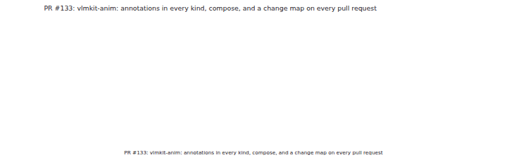
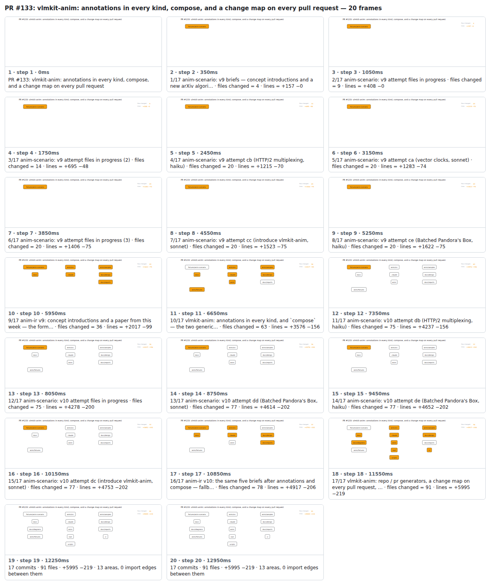

## PR #133: vlmkit-anim: annotations in every kind, compose, and a change map on every pull request



<details><summary>Every step</summary>



```
PR #133: vlmkit-anim: annotations in every kind, compose, and a change map on every pull request — 20 steps, 13160ms, 19 nodes
 1. [    0ms] PR #133: vlmkit-anim: annotations in every kind, compose, and a change map on every pull request
 2. [  350ms] 1/17 anim-scenario: v9 briefs — concept introductions and a new arXiv algori… · files changed = 4 · lines = +157 −0
 3. [ 1050ms] 2/17 anim-scenario: v9 attempt files in progress · files changed = 9 · lines = +408 −0
 4. [ 1750ms] 3/17 anim-scenario: v9 attempt files in progress (2) · files changed = 14 · lines = +695 −48
 5. [ 2450ms] 4/17 anim-scenario: v9 attempt cb (HTTP/2 multiplexing, haiku) · files changed = 20 · lines = +1215 −70
 6. [ 3150ms] 5/17 anim-scenario: v9 attempt ca (vector clocks, sonnet) · files changed = 20 · lines = +1283 −74
 7. [ 3850ms] 6/17 anim-scenario: v9 attempt files in progress (3) · files changed = 20 · lines = +1406 −75
 8. [ 4550ms] 7/17 anim-scenario: v9 attempt cc (introduce vlmkit-anim, sonnet) · files changed = 20 · lines = +1523 −75
 9. [ 5250ms] 8/17 anim-scenario: v9 attempt ce (Batched Pandora's Box, haiku) · files changed = 20 · lines = +1622 −75
10. [ 5950ms] 9/17 anim-ir v9: concept introductions and a paper from this week — the form… · files changed = 36 · lines = +2017 −99
11. [ 6650ms] 10/17 vlmkit-anim: annotations in every kind, and `compose` — the two generic… · files changed = 63 · lines = +3576 −156
12. [ 7350ms] 11/17 anim-scenario: v10 attempt db (HTTP/2 multiplexing, haiku) · files changed = 75 · lines = +4237 −156
13. [ 8050ms] 12/17 anim-scenario: v10 attempt files in progress · files changed = 75 · lines = +4278 −200
14. [ 8750ms] 13/17 anim-scenario: v10 attempt dd (Batched Pandora's Box, sonnet) · files changed = 77 · lines = +4614 −202
15. [ 9450ms] 14/17 anim-scenario: v10 attempt de (Batched Pandora's Box, haiku) · files changed = 77 · lines = +4652 −202
16. [10150ms] 15/17 anim-scenario: v10 attempt dc (introduce vlmkit-anim, sonnet) · files changed = 77 · lines = +4753 −202
17. [10850ms] 16/17 anim-ir v10: the same five briefs after annotations and compose — fallb… · files changed = 78 · lines = +4917 −206
18. [11550ms] 17/17 vlmkit-anim: repo / pr generators, a change map on every pull request, … · files changed = 91 · lines = +5995 −219
19. [12250ms] 17 commits · 91 files · +5995 −219 · 13 areas, 0 import edges between them
20. [12950ms] (end)
```

</details>

<sub>Generated by `vlmkit-anim pr`; the scene is [`change-map.scene.json`](./change-map.scene.json) — edit it and re-run `vlmkit-anim video` for a different cut.</sub>
