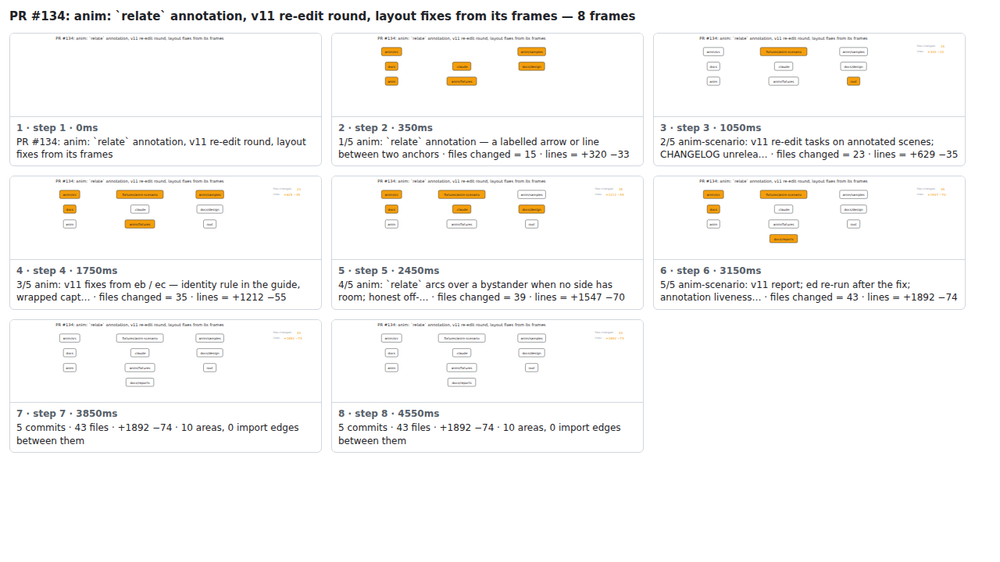

## PR #134: anim: `relate` annotation, v11 re-edit round, layout fixes from its frames


<details><summary>Every step</summary>



```
PR #134: anim: `relate` annotation, v11 re-edit round, layout fixes from its frames — 8 steps, 4760ms, 16 nodes
 1. [    0ms] PR #134: anim: `relate` annotation, v11 re-edit round, layout fixes from its frames
 2. [  350ms] 1/5 anim: `relate` annotation — a labelled arrow or line between two anchors · files changed = 15 · lines = +320 −33
 3. [ 1050ms] 2/5 anim-scenario: v11 re-edit tasks on annotated scenes; CHANGELOG unrelea… · files changed = 23 · lines = +629 −35
 4. [ 1750ms] 3/5 anim: v11 fixes from eb / ec — identity rule in the guide, wrapped capt… · files changed = 35 · lines = +1212 −55
 5. [ 2450ms] 4/5 anim: `relate` arcs over a bystander when no side has room; honest off-… · files changed = 39 · lines = +1547 −70
 6. [ 3150ms] 5/5 anim-scenario: v11 report; ed re-run after the fix; annotation liveness… · files changed = 43 · lines = +1892 −74
 7. [ 3850ms] 5 commits · 43 files · +1892 −74 · 10 areas, 0 import edges between them
 8. [ 4550ms] (end)
```

</details>

<sub>Generated by `vlmkit-anim pr`; the scene is [`change-map.scene.json`](./change-map.scene.json) — edit it and re-run `vlmkit-anim video` for a different cut.</sub>
