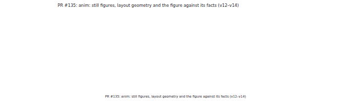
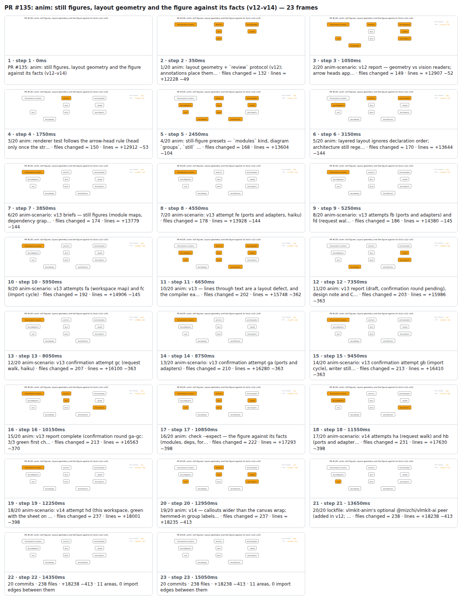

## PR #135: anim: still figures, layout geometry and the figure against its facts (v12–v14)



<details><summary>Every step</summary>



```
PR #135: anim: still figures, layout geometry and the figure against its facts (v12–v14) — 23 steps, 15260ms, 17 nodes
 1. [    0ms] PR #135: anim: still figures, layout geometry and the figure against its facts (v12–v14)
 2. [  350ms] 1/20 anim: layout geometry + `review` protocol (v12); annotations place them… · files changed = 132 · lines = +12228 −49
 3. [ 1050ms] 2/20 anim-scenario: v12 report — geometry vs vision readers; arrow heads app… · files changed = 149 · lines = +12907 −52
 4. [ 1750ms] 3/20 anim: renderer test follows the arrow-head rule (head only once the str… · files changed = 150 · lines = +12912 −53
 5. [ 2450ms] 4/20 anim: still-figure presets — `modules` kind, diagram `groups`, `still` … · files changed = 168 · lines = +13604 −104
 6. [ 3150ms] 5/20 anim: layered layout ignores declaration order; architecture still rege… · files changed = 170 · lines = +13644 −144
 7. [ 3850ms] 6/20 anim-scenario: v13 briefs — still figures (module maps, dependency grap… · files changed = 174 · lines = +13779 −144
 8. [ 4550ms] 7/20 anim-scenario: v13 attempt fe (ports and adapters, haiku) · files changed = 178 · lines = +13928 −144
 9. [ 5250ms] 8/20 anim-scenario: v13 attempts fb (ports and adapters) and fd (request wal… · files changed = 186 · lines = +14380 −145
10. [ 5950ms] 9/20 anim-scenario: v13 attempts fa (workspace map) and fc (import cycle) · files changed = 192 · lines = +14906 −145
11. [ 6650ms] 10/20 anim: v13 — lines through text are a layout defect, and the compiler ea… · files changed = 202 · lines = +15748 −362
12. [ 7350ms] 11/20 anim: v13 report (draft, confirmation round pending), design note and C… · files changed = 203 · lines = +15986 −363
13. [ 8050ms] 12/20 anim-scenario: v13 confirmation attempt gc (request walk, haiku) · files changed = 207 · lines = +16100 −363
14. [ 8750ms] 13/20 anim-scenario: v13 confirmation attempt ga (ports and adapters) · files changed = 210 · lines = +16280 −363
15. [ 9450ms] 14/20 anim-scenario: v13 confirmation attempt gb (import cycle), writer still… · files changed = 213 · lines = +16410 −363
16. [10150ms] 15/20 anim: v13 report complete (confirmation round ga–gc: 3/3 green first ch… · files changed = 213 · lines = +16563 −370
17. [10850ms] 16/20 anim: check --expect — the figure against its facts (modules, deps, for… · files changed = 222 · lines = +17293 −398
18. [11550ms] 17/20 anim-scenario: v14 attempts ha (request walk) and hb (ports and adapter… · files changed = 231 · lines = +17630 −398
19. [12250ms] 18/20 anim-scenario: v14 attempt hd (this workspace, green with the sheet on … · files changed = 237 · lines = +18001 −398
20. [12950ms] 19/20 anim: v14 — callouts wider than the canvas wrap; hemmed-in group labels… · files changed = 237 · lines = +18235 −413
21. [13650ms] 20/20 lockfile: vlmkit-anim's optional @mizchi/vlmkit-ai peer (added in v12; … · files changed = 238 · lines = +18238 −413
22. [14350ms] 20 commits · 238 files · +18238 −413 · 11 areas, 0 import edges between them
23. [15050ms] (end)
```

</details>

<sub>Generated by `vlmkit-anim pr`; the scene is [`change-map.scene.json`](./change-map.scene.json) — edit it and re-run `vlmkit-anim video` for a different cut, or `vlmkit-anim still` for the figure alone ([`change-map.svg`](./change-map.svg)).</sub>
