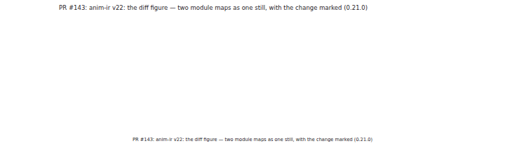
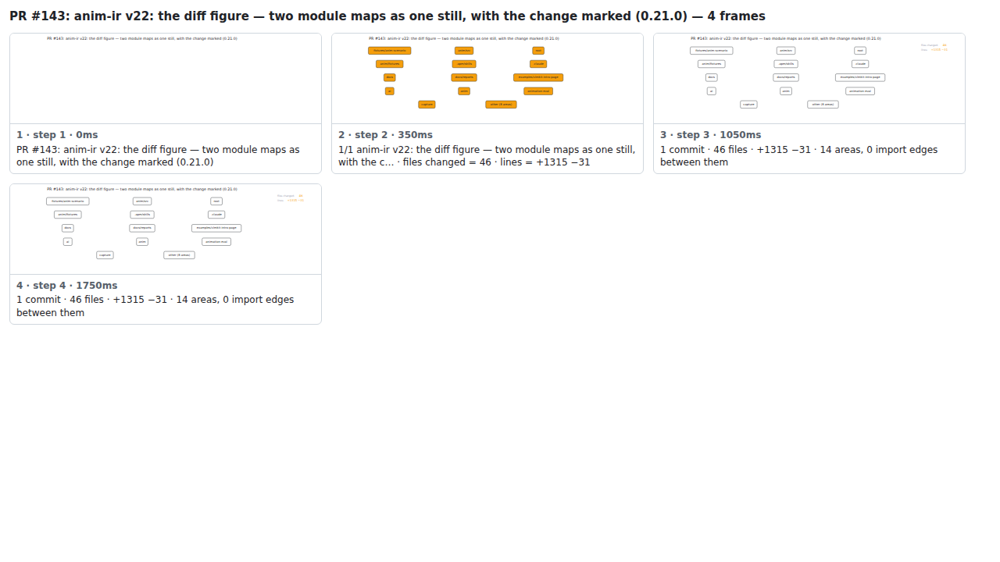

## PR #143: anim-ir v22: the diff figure — two module maps as one still, with the change marked (0.21.0)



<details><summary>Every step</summary>



```
PR #143: anim-ir v22: the diff figure — two module maps as one still, with the change marked (0.21.0) — 4 steps, 1960ms, 20 nodes
 1. [    0ms] PR #143: anim-ir v22: the diff figure — two module maps as one still, with the change marked (0.21.0)
 2. [  350ms] 1/1 anim-ir v22: the diff figure — two module maps as one still, with the c… · files changed = 46 · lines = +1315 −31
 3. [ 1050ms] 1 commit · 46 files · +1315 −31 · 14 areas, 0 import edges between them
 4. [ 1750ms] (end)
```

</details>

<sub>Generated by `vlmkit-anim pr`; the scene is [`change-map.scene.json`](./change-map.scene.json) — edit it and re-run `vlmkit-anim video` for a different cut, or `vlmkit-anim still` for the figure alone ([`change-map.svg`](./change-map.svg)).</sub>
