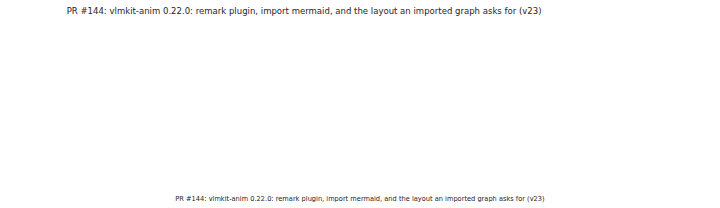
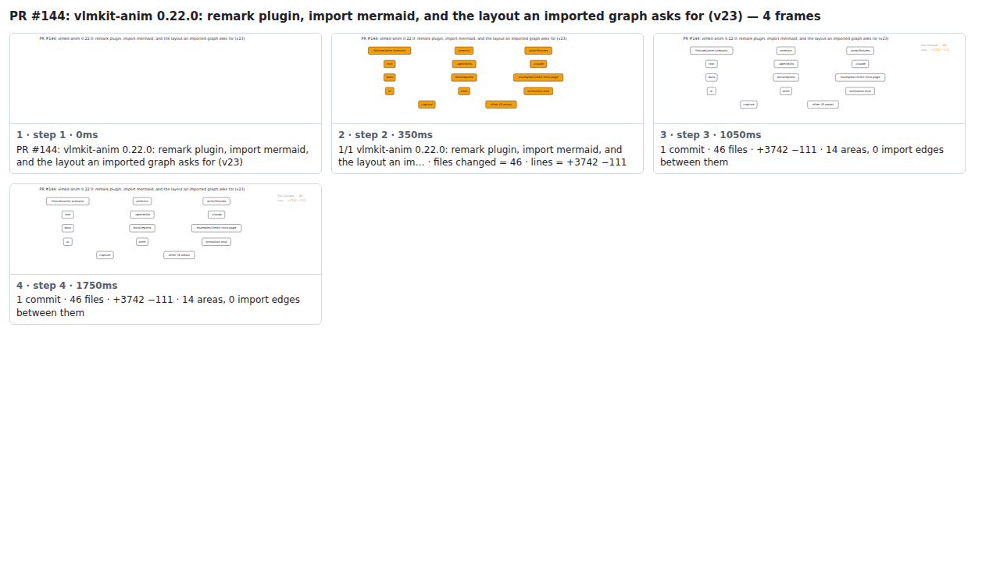

## PR #144: vlmkit-anim 0.22.0: remark plugin, import mermaid, and the layout an imported graph asks for (v23)



<details><summary>Every step</summary>



```
PR #144: vlmkit-anim 0.22.0: remark plugin, import mermaid, and the layout an imported graph asks for (v23) — 4 steps, 1960ms, 20 nodes
 1. [    0ms] PR #144: vlmkit-anim 0.22.0: remark plugin, import mermaid, and the layout an imported graph asks for (v23)
 2. [  350ms] 1/1 vlmkit-anim 0.22.0: remark plugin, import mermaid, and the layout an im… · files changed = 46 · lines = +3742 −111
 3. [ 1050ms] 1 commit · 46 files · +3742 −111 · 14 areas, 0 import edges between them
 4. [ 1750ms] (end)
```

</details>

<sub>Generated by `vlmkit-anim pr`; the scene is [`change-map.scene.json`](./change-map.scene.json) — edit it and re-run `vlmkit-anim video` for a different cut, or `vlmkit-anim still` for the figure alone ([`change-map.svg`](./change-map.svg)).</sub>
