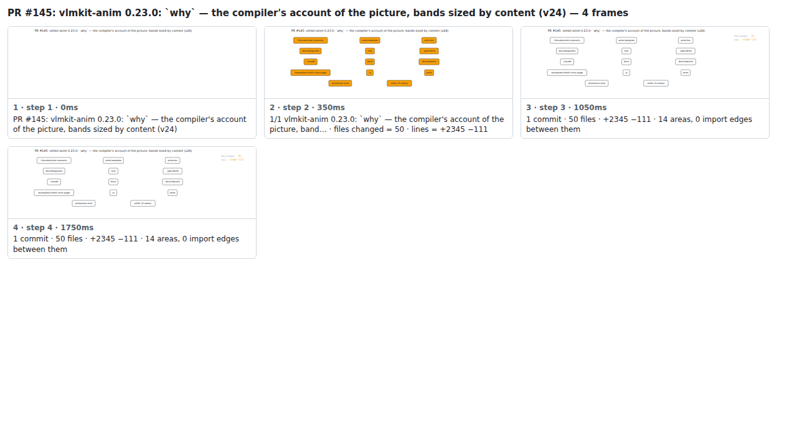

## PR #145: vlmkit-anim 0.23.0: `why` — the compiler's account of the picture, bands sized by content (v24)


<details><summary>Every step</summary>



```
PR #145: vlmkit-anim 0.23.0: `why` — the compiler's account of the picture, bands sized by content (v24) — 4 steps, 1960ms, 20 nodes
 1. [    0ms] PR #145: vlmkit-anim 0.23.0: `why` — the compiler's account of the picture, bands sized by content (v24)
 2. [  350ms] 1/1 vlmkit-anim 0.23.0: `why` — the compiler's account of the picture, band… · files changed = 50 · lines = +2345 −111
 3. [ 1050ms] 1 commit · 50 files · +2345 −111 · 14 areas, 0 import edges between them
 4. [ 1750ms] (end)
```

</details>

<sub>Generated by `vlmkit-anim pr`; the scene is [`change-map.scene.json`](./change-map.scene.json) — edit it and re-run `vlmkit-anim video` for a different cut, or `vlmkit-anim still` for the figure alone ([`change-map.svg`](./change-map.svg)).</sub>
