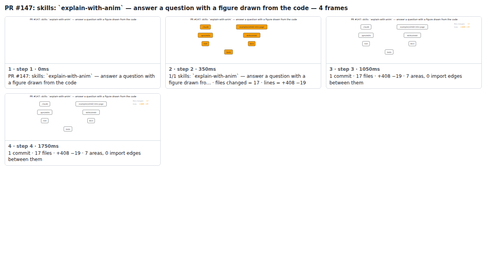

## PR #147: skills: `explain-with-anim` — answer a question with a figure drawn from the code


<details><summary>Every step</summary>



```
PR #147: skills: `explain-with-anim` — answer a question with a figure drawn from the code — 4 steps, 1960ms, 13 nodes
 1. [    0ms] PR #147: skills: `explain-with-anim` — answer a question with a figure drawn from the code
 2. [  350ms] 1/1 skills: `explain-with-anim` — answer a question with a figure drawn fro… · files changed = 17 · lines = +408 −19
 3. [ 1050ms] 1 commit · 17 files · +408 −19 · 7 areas, 0 import edges between them
 4. [ 1750ms] (end)
```

</details>

<sub>Generated by `vlmkit-anim pr`; the scene is [`change-map.scene.json`](./change-map.scene.json) — edit it and re-run `vlmkit-anim video` for a different cut, or `vlmkit-anim still` for the figure alone ([`change-map.svg`](./change-map.svg)).</sub>
