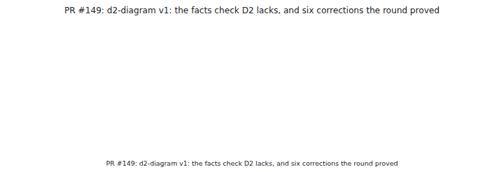
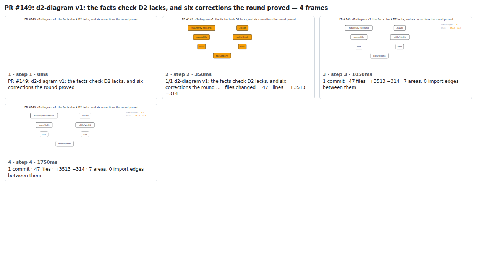

## PR #149: d2-diagram v1: the facts check D2 lacks, and six corrections the round proved



<details><summary>Every step</summary>



```
PR #149: d2-diagram v1: the facts check D2 lacks, and six corrections the round proved — 4 steps, 1960ms, 13 nodes
 1. [    0ms] PR #149: d2-diagram v1: the facts check D2 lacks, and six corrections the round proved
 2. [  350ms] 1/1 d2-diagram v1: the facts check D2 lacks, and six corrections the round … · files changed = 47 · lines = +3513 −314
 3. [ 1050ms] 1 commit · 47 files · +3513 −314 · 7 areas, 0 import edges between them
 4. [ 1750ms] (end)
```

</details>

<sub>Generated by `vlmkit-anim pr`; the scene is [`change-map.scene.json`](./change-map.scene.json) — edit it and re-run `vlmkit-anim video` for a different cut, or `vlmkit-anim still` for the figure alone ([`change-map.svg`](./change-map.svg)).</sub>
