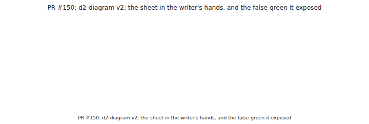
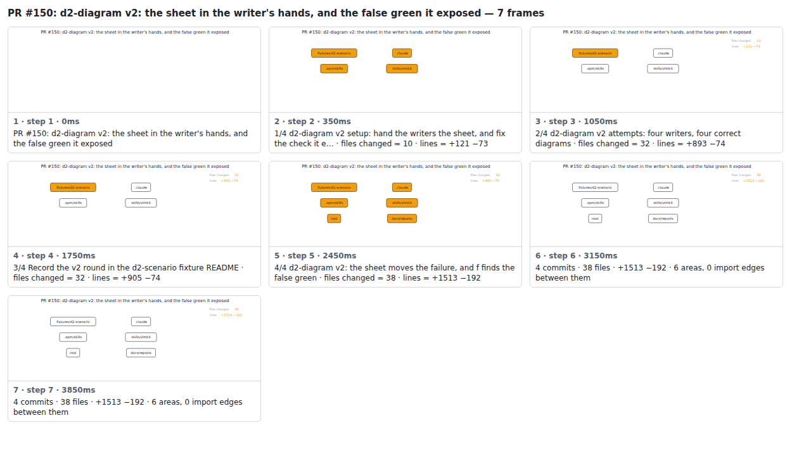

## PR #150: d2-diagram v2: the sheet in the writer's hands, and the false green it exposed



<details><summary>Every step</summary>



```
PR #150: d2-diagram v2: the sheet in the writer's hands, and the false green it exposed — 7 steps, 4060ms, 12 nodes
 1. [    0ms] PR #150: d2-diagram v2: the sheet in the writer's hands, and the false green it exposed
 2. [  350ms] 1/4 d2-diagram v2 setup: hand the writers the sheet, and fix the check it e… · files changed = 10 · lines = +121 −73
 3. [ 1050ms] 2/4 d2-diagram v2 attempts: four writers, four correct diagrams · files changed = 32 · lines = +893 −74
 4. [ 1750ms] 3/4 Record the v2 round in the d2-scenario fixture README · files changed = 32 · lines = +905 −74
 5. [ 2450ms] 4/4 d2-diagram v2: the sheet moves the failure, and f finds the false green · files changed = 38 · lines = +1513 −192
 6. [ 3150ms] 4 commits · 38 files · +1513 −192 · 6 areas, 0 import edges between them
 7. [ 3850ms] (end)
```

</details>

<sub>Generated by `vlmkit-anim pr`; the scene is [`change-map.scene.json`](./change-map.scene.json) — edit it and re-run `vlmkit-anim video` for a different cut, or `vlmkit-anim still` for the figure alone ([`change-map.svg`](./change-map.svg)).</sub>
