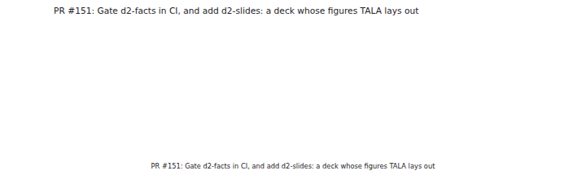
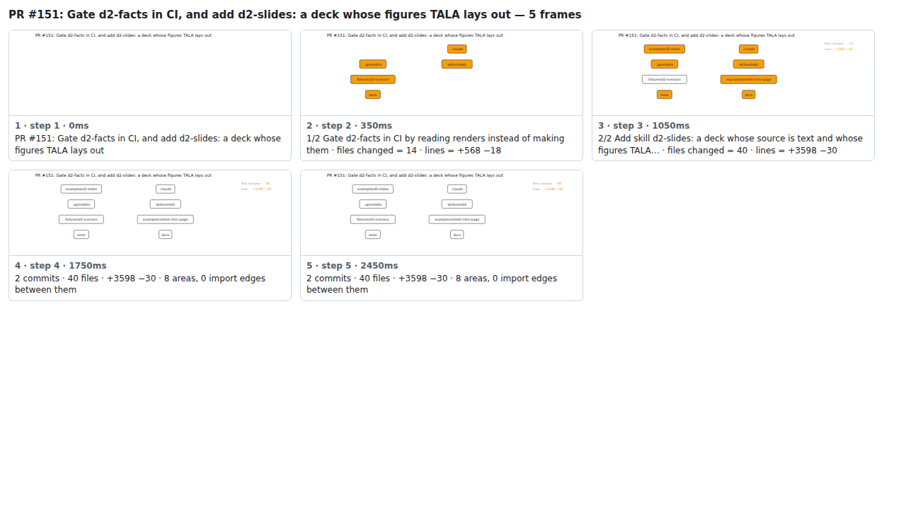

## PR #151: Gate d2-facts in CI, and add d2-slides: a deck whose figures TALA lays out



<details><summary>Every step</summary>



```
PR #151: Gate d2-facts in CI, and add d2-slides: a deck whose figures TALA lays out — 5 steps, 2660ms, 14 nodes
 1. [    0ms] PR #151: Gate d2-facts in CI, and add d2-slides: a deck whose figures TALA lays out
 2. [  350ms] 1/2 Gate d2-facts in CI by reading renders instead of making them · files changed = 14 · lines = +568 −18
 3. [ 1050ms] 2/2 Add skill d2-slides: a deck whose source is text and whose figures TALA… · files changed = 40 · lines = +3598 −30
 4. [ 1750ms] 2 commits · 40 files · +3598 −30 · 8 areas, 0 import edges between them
 5. [ 2450ms] (end)
```

</details>

<sub>Generated by `vlmkit-anim pr`; the scene is [`change-map.scene.json`](./change-map.scene.json) — edit it and re-run `vlmkit-anim video` for a different cut, or `vlmkit-anim still` for the figure alone ([`change-map.svg`](./change-map.svg)).</sub>
