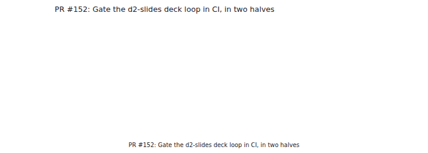
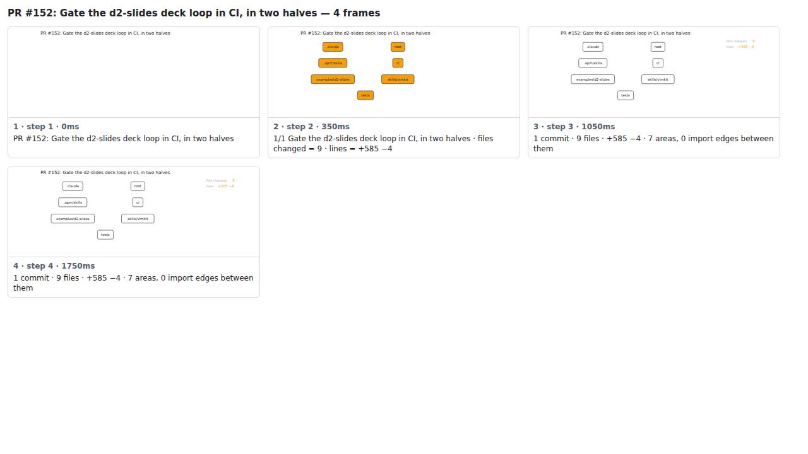

## PR #152: Gate the d2-slides deck loop in CI, in two halves



<details><summary>Every step</summary>



```
PR #152: Gate the d2-slides deck loop in CI, in two halves — 4 steps, 1960ms, 13 nodes
 1. [    0ms] PR #152: Gate the d2-slides deck loop in CI, in two halves
 2. [  350ms] 1/1 Gate the d2-slides deck loop in CI, in two halves · files changed = 9 · lines = +585 −4
 3. [ 1050ms] 1 commit · 9 files · +585 −4 · 7 areas, 0 import edges between them
 4. [ 1750ms] (end)
```

</details>

<sub>Generated by `vlmkit-anim pr`; the scene is [`change-map.scene.json`](./change-map.scene.json) — edit it and re-run `vlmkit-anim video` for a different cut, or `vlmkit-anim still` for the figure alone ([`change-map.svg`](./change-map.svg)).</sub>
