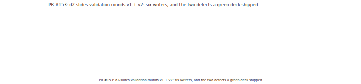
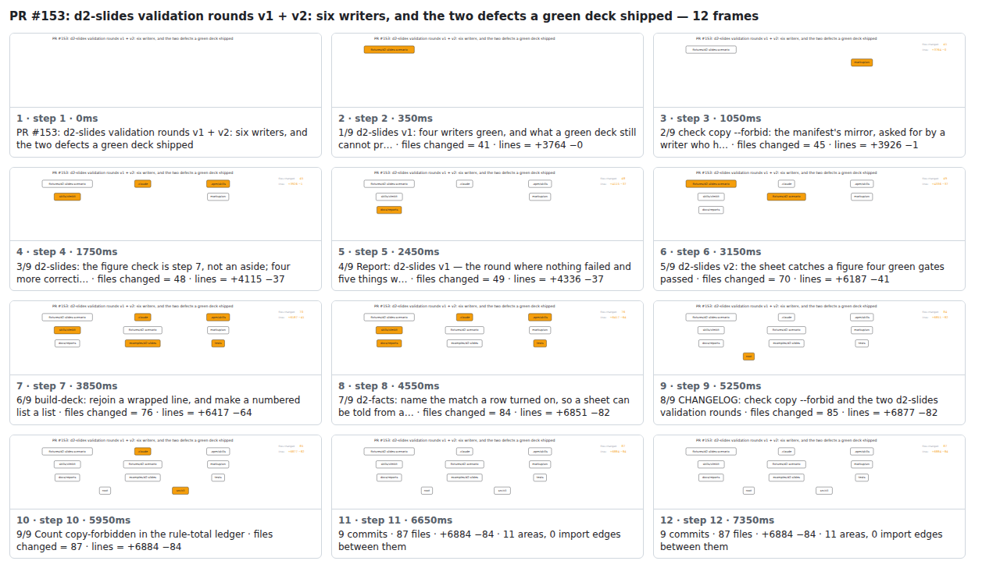

## PR #153: d2-slides validation rounds v1 + v2: six writers, and the two defects a green deck shipped



<details><summary>Every step</summary>



```
PR #153: d2-slides validation rounds v1 + v2: six writers, and the two defects a green deck shipped — 12 steps, 7560ms, 17 nodes
 1. [    0ms] PR #153: d2-slides validation rounds v1 + v2: six writers, and the two defects a green deck shipped
 2. [  350ms] 1/9 d2-slides v1: four writers green, and what a green deck still cannot pr… · files changed = 41 · lines = +3764 −0
 3. [ 1050ms] 2/9 check copy --forbid: the manifest's mirror, asked for by a writer who h… · files changed = 45 · lines = +3926 −1
 4. [ 1750ms] 3/9 d2-slides: the figure check is step 7, not an aside; four more correcti… · files changed = 48 · lines = +4115 −37
 5. [ 2450ms] 4/9 Report: d2-slides v1 — the round where nothing failed and five things w… · files changed = 49 · lines = +4336 −37
 6. [ 3150ms] 5/9 d2-slides v2: the sheet catches a figure four green gates passed · files changed = 70 · lines = +6187 −41
 7. [ 3850ms] 6/9 build-deck: rejoin a wrapped line, and make a numbered list a list · files changed = 76 · lines = +6417 −64
 8. [ 4550ms] 7/9 d2-facts: name the match a row turned on, so a sheet can be told from a… · files changed = 84 · lines = +6851 −82
 9. [ 5250ms] 8/9 CHANGELOG: check copy --forbid and the two d2-slides validation rounds · files changed = 85 · lines = +6877 −82
10. [ 5950ms] 9/9 Count copy-forbidden in the rule-total ledger · files changed = 87 · lines = +6884 −84
11. [ 6650ms] 9 commits · 87 files · +6884 −84 · 11 areas, 0 import edges between them
12. [ 7350ms] (end)
```

</details>

<sub>Generated by `vlmkit-anim pr`; the scene is [`change-map.scene.json`](./change-map.scene.json) — edit it and re-run `vlmkit-anim video` for a different cut, or `vlmkit-anim still` for the figure alone ([`change-map.svg`](./change-map.svg)).</sub>
