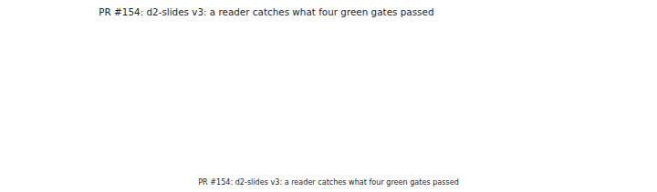
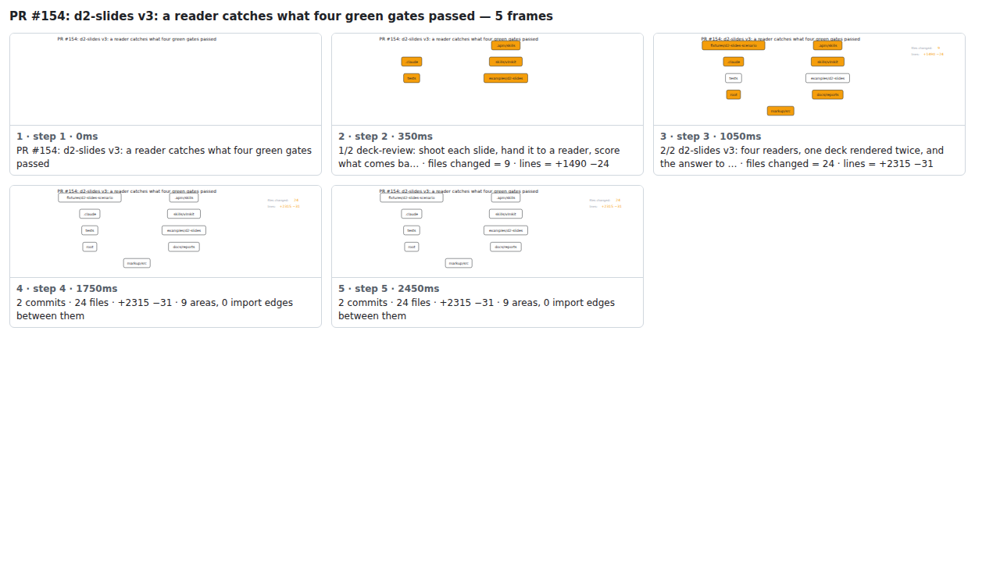

## PR #154: d2-slides v3: a reader catches what four green gates passed



<details><summary>Every step</summary>



```
PR #154: d2-slides v3: a reader catches what four green gates passed — 5 steps, 2660ms, 15 nodes
 1. [    0ms] PR #154: d2-slides v3: a reader catches what four green gates passed
 2. [  350ms] 1/2 deck-review: shoot each slide, hand it to a reader, score what comes ba… · files changed = 9 · lines = +1490 −24
 3. [ 1050ms] 2/2 d2-slides v3: four readers, one deck rendered twice, and the answer to … · files changed = 24 · lines = +2315 −31
 4. [ 1750ms] 2 commits · 24 files · +2315 −31 · 9 areas, 0 import edges between them
 5. [ 2450ms] (end)
```

</details>

<sub>Generated by `vlmkit-anim pr`; the scene is [`change-map.scene.json`](./change-map.scene.json) — edit it and re-run `vlmkit-anim video` for a different cut, or `vlmkit-anim still` for the figure alone ([`change-map.svg`](./change-map.svg)).</sub>
