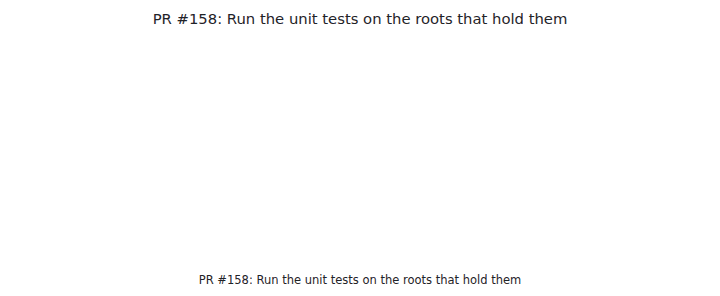
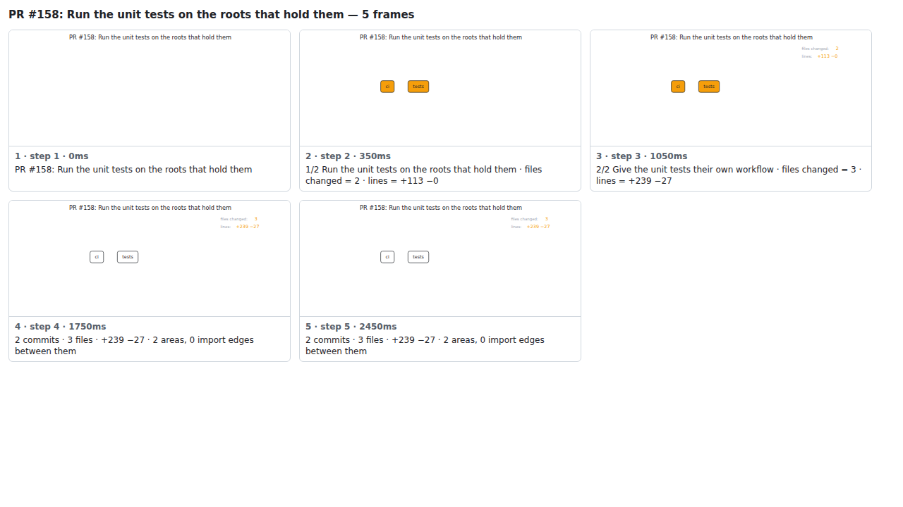

## PR #158: Run the unit tests on the roots that hold them



<details><summary>Every step</summary>



```
PR #158: Run the unit tests on the roots that hold them — 5 steps, 2660ms, 8 nodes
 1. [    0ms] PR #158: Run the unit tests on the roots that hold them
 2. [  350ms] 1/2 Run the unit tests on the roots that hold them · files changed = 2 · lines = +113 −0
 3. [ 1050ms] 2/2 Give the unit tests their own workflow · files changed = 3 · lines = +239 −27
 4. [ 1750ms] 2 commits · 3 files · +239 −27 · 2 areas, 0 import edges between them
 5. [ 2450ms] (end)
```

</details>

<sub>Generated by `vlmkit-anim pr`; the scene is [`change-map.scene.json`](./change-map.scene.json) — edit it and re-run `vlmkit-anim video` for a different cut, or `vlmkit-anim still` for the figure alone ([`change-map.svg`](./change-map.svg)).</sub>
