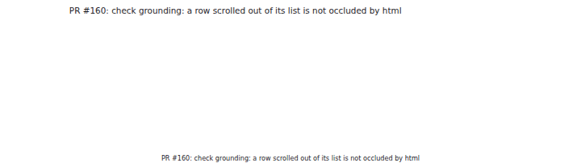
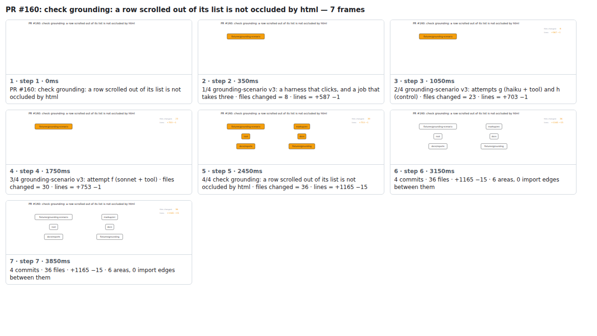

## PR #160: check grounding: a row scrolled out of its list is not occluded by html



<details><summary>Every step</summary>



```
PR #160: check grounding: a row scrolled out of its list is not occluded by html — 7 steps, 4060ms, 12 nodes
 1. [    0ms] PR #160: check grounding: a row scrolled out of its list is not occluded by html
 2. [  350ms] 1/4 grounding-scenario v3: a harness that clicks, and a job that takes three · files changed = 8 · lines = +587 −1
 3. [ 1050ms] 2/4 grounding-scenario v3: attempts g (haiku + tool) and h (control) · files changed = 23 · lines = +703 −1
 4. [ 1750ms] 3/4 grounding-scenario v3: attempt f (sonnet + tool) · files changed = 30 · lines = +753 −1
 5. [ 2450ms] 4/4 check grounding: a row scrolled out of its list is not occluded by html · files changed = 36 · lines = +1165 −15
 6. [ 3150ms] 4 commits · 36 files · +1165 −15 · 6 areas, 0 import edges between them
 7. [ 3850ms] (end)
```

</details>

<sub>Generated by `vlmkit-anim pr`; the scene is [`change-map.scene.json`](./change-map.scene.json) — edit it and re-run `vlmkit-anim video` for a different cut, or `vlmkit-anim still` for the figure alone ([`change-map.svg`](./change-map.svg)).</sub>
