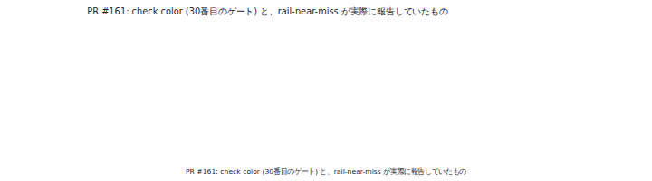
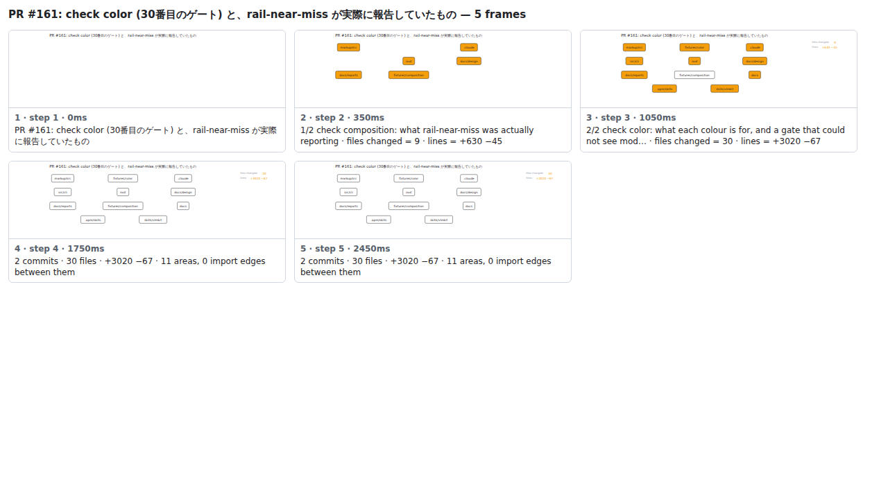

## PR #161: check color (30番目のゲート) と、rail-near-miss が実際に報告していたもの



<details><summary>Every step</summary>



```
PR #161: check color (30番目のゲート) と、rail-near-miss が実際に報告していたもの — 5 steps, 2660ms, 17 nodes
 1. [    0ms] PR #161: check color (30番目のゲート) と、rail-near-miss が実際に報告していたもの
 2. [  350ms] 1/2 check composition: what rail-near-miss was actually reporting · files changed = 9 · lines = +630 −45
 3. [ 1050ms] 2/2 check color: what each colour is for, and a gate that could not see mod… · files changed = 30 · lines = +3020 −67
 4. [ 1750ms] 2 commits · 30 files · +3020 −67 · 11 areas, 0 import edges between them
 5. [ 2450ms] (end)
```

</details>

<sub>Generated by `vlmkit-anim pr`; the scene is [`change-map.scene.json`](./change-map.scene.json) — edit it and re-run `vlmkit-anim video` for a different cut, or `vlmkit-anim still` for the figure alone ([`change-map.svg`](./change-map.svg)).</sub>
