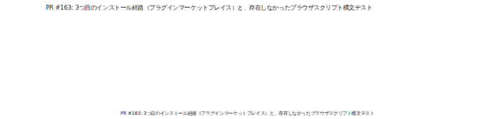
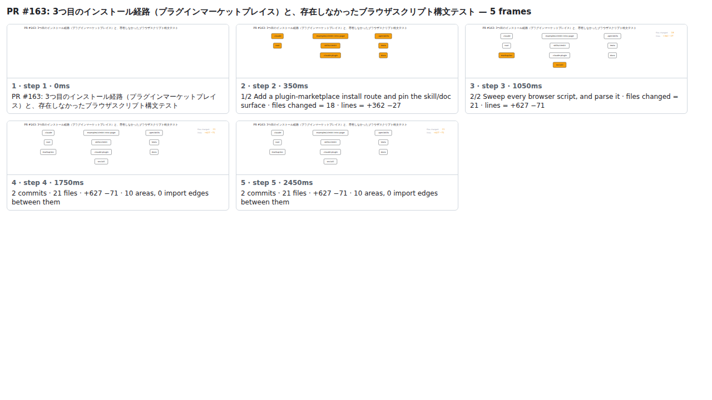

## PR #163: 3つ目のインストール経路（プラグインマーケットプレイス）と、存在しなかったブラウザスクリプト構文テスト



<details><summary>Every step</summary>



```
PR #163: 3つ目のインストール経路（プラグインマーケットプレイス）と、存在しなかったブラウザスクリプト構文テスト — 5 steps, 2660ms, 16 nodes
 1. [    0ms] PR #163: 3つ目のインストール経路（プラグインマーケットプレイス）と、存在しなかったブラウザスクリプト構文テスト
 2. [  350ms] 1/2 Add a plugin-marketplace install route and pin the skill/doc surface · files changed = 18 · lines = +362 −27
 3. [ 1050ms] 2/2 Sweep every browser script, and parse it · files changed = 21 · lines = +627 −71
 4. [ 1750ms] 2 commits · 21 files · +627 −71 · 10 areas, 0 import edges between them
 5. [ 2450ms] (end)
```

</details>

<sub>Generated by `vlmkit-anim pr`; the scene is [`change-map.scene.json`](./change-map.scene.json) — edit it and re-run `vlmkit-anim video` for a different cut, or `vlmkit-anim still` for the figure alone ([`change-map.svg`](./change-map.svg)).</sub>
