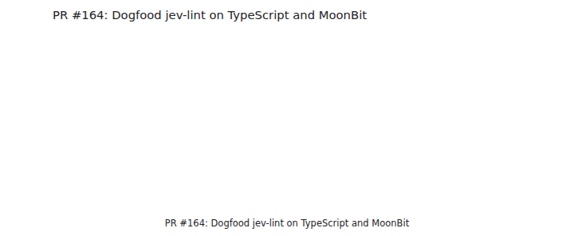
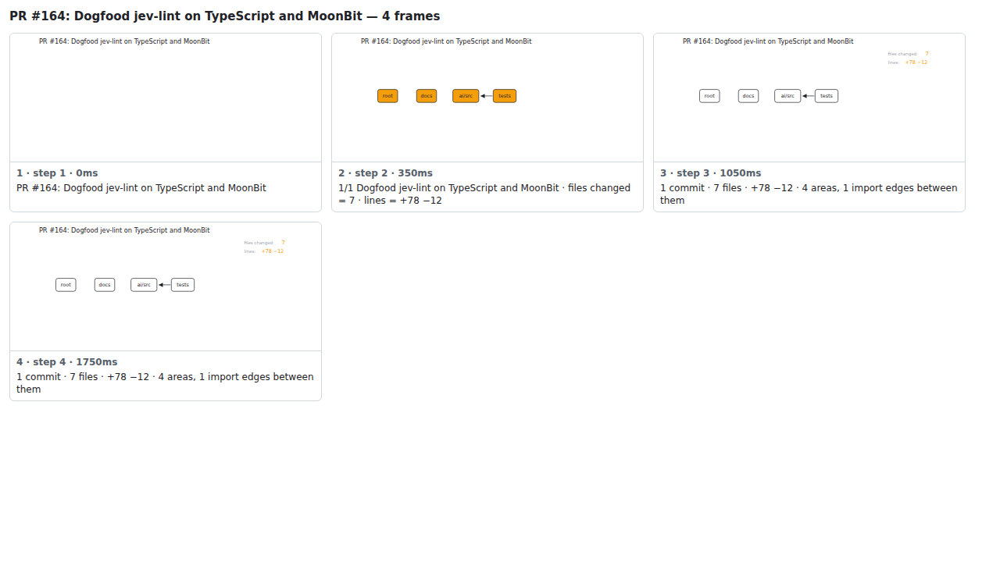

## PR #164: Dogfood jev-lint on TypeScript and MoonBit



<details><summary>Every step</summary>



```
PR #164: Dogfood jev-lint on TypeScript and MoonBit — 4 steps, 1960ms, 11 nodes
 1. [    0ms] PR #164: Dogfood jev-lint on TypeScript and MoonBit
 2. [  350ms] 1/1 Dogfood jev-lint on TypeScript and MoonBit · files changed = 7 · lines = +78 −12
 3. [ 1050ms] 1 commit · 7 files · +78 −12 · 4 areas, 1 import edges between them
 4. [ 1750ms] (end)
```

</details>

<sub>Generated by `vlmkit-anim pr`; the scene is [`change-map.scene.json`](./change-map.scene.json) — edit it and re-run `vlmkit-anim video` for a different cut, or `vlmkit-anim still` for the figure alone ([`change-map.svg`](./change-map.svg)).</sub>
