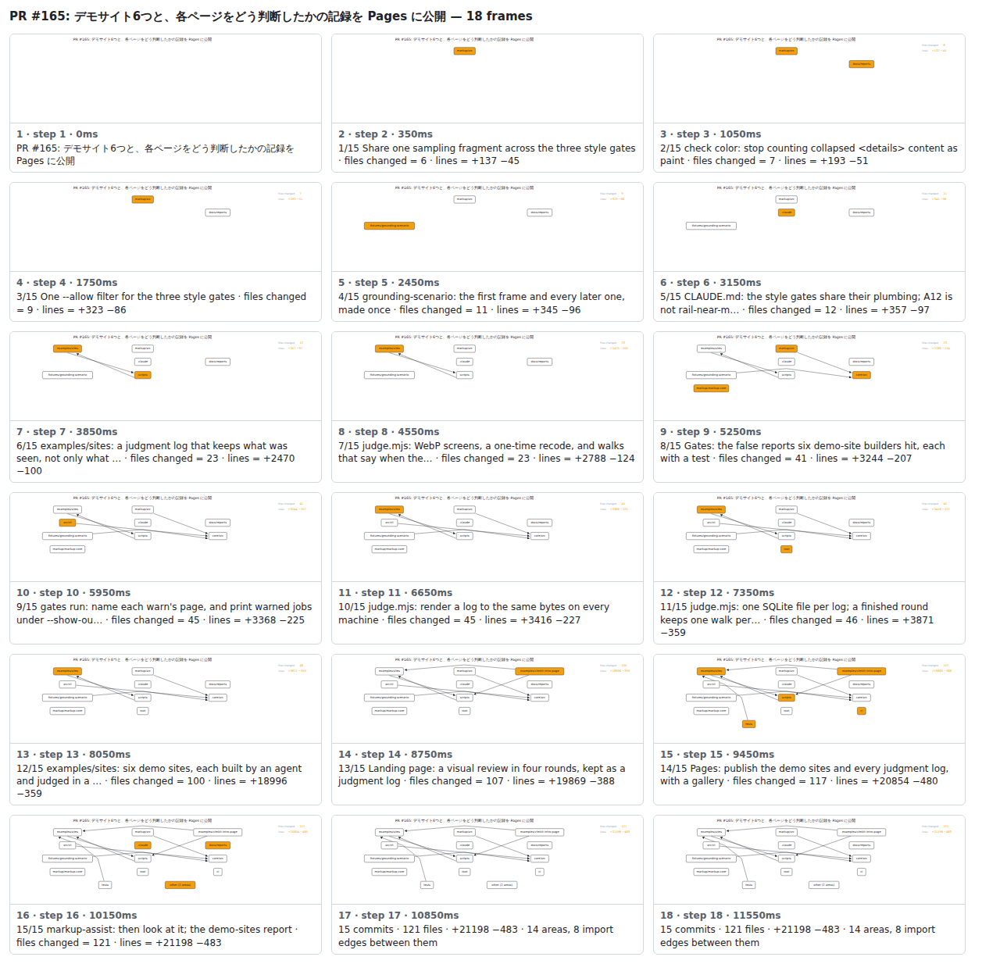

## PR #165: デモサイト6つと、各ページをどう判断したかの記録を Pages に公開


<details><summary>Every step</summary>



```
PR #165: デモサイト6つと、各ページをどう判断したかの記録を Pages に公開 — 18 steps, 11760ms, 28 nodes
 1. [    0ms] PR #165: デモサイト6つと、各ページをどう判断したかの記録を Pages に公開
 2. [  350ms] 1/15 Share one sampling fragment across the three style gates · files changed = 6 · lines = +137 −45
 3. [ 1050ms] 2/15 check color: stop counting collapsed <details> content as paint · files changed = 7 · lines = +193 −51
 4. [ 1750ms] 3/15 One --allow filter for the three style gates · files changed = 9 · lines = +323 −86
 5. [ 2450ms] 4/15 grounding-scenario: the first frame and every later one, made once · files changed = 11 · lines = +345 −96
 6. [ 3150ms] 5/15 CLAUDE.md: the style gates share their plumbing; A12 is not rail-near-m… · files changed = 12 · lines = +357 −97
 7. [ 3850ms] 6/15 examples/sites: a judgment log that keeps what was seen, not only what … · files changed = 23 · lines = +2470 −100
 8. [ 4550ms] 7/15 judge.mjs: WebP screens, a one-time recode, and walks that say when the… · files changed = 23 · lines = +2788 −124
 9. [ 5250ms] 8/15 Gates: the false reports six demo-site builders hit, each with a test · files changed = 41 · lines = +3244 −207
10. [ 5950ms] 9/15 gates run: name each warn's page, and print warned jobs under --show-ou… · files changed = 45 · lines = +3368 −225
11. [ 6650ms] 10/15 judge.mjs: render a log to the same bytes on every machine · files changed = 45 · lines = +3416 −227
12. [ 7350ms] 11/15 judge.mjs: one SQLite file per log; a finished round keeps one walk per… · files changed = 46 · lines = +3871 −359
13. [ 8050ms] 12/15 examples/sites: six demo sites, each built by an agent and judged in a … · files changed = 100 · lines = +18996 −359
14. [ 8750ms] 13/15 Landing page: a visual review in four rounds, kept as a judgment log · files changed = 107 · lines = +19869 −388
15. [ 9450ms] 14/15 Pages: publish the demo sites and every judgment log, with a gallery · files changed = 117 · lines = +20854 −480
16. [10150ms] 15/15 markup-assist: then look at it; the demo-sites report · files changed = 121 · lines = +21198 −483
17. [10850ms] 15 commits · 121 files · +21198 −483 · 14 areas, 8 import edges between them
18. [11550ms] (end)
```

</details>

<sub>Generated by `vlmkit-anim pr`; the scene is [`change-map.scene.json`](./change-map.scene.json) — edit it and re-run `vlmkit-anim video` for a different cut, or `vlmkit-anim still` for the figure alone ([`change-map.svg`](./change-map.svg)).</sub>
