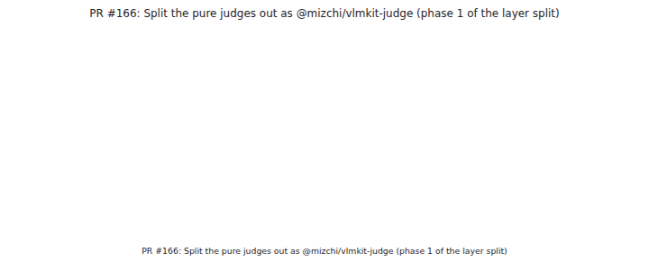
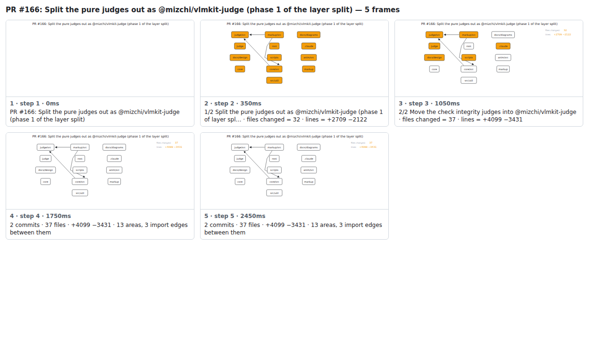

## PR #166: Split the pure judges out as @mizchi/vlmkit-judge (phase 1 of the layer split)



<details><summary>Every step</summary>



```
PR #166: Split the pure judges out as @mizchi/vlmkit-judge (phase 1 of the layer split) — 5 steps, 2660ms, 22 nodes
 1. [    0ms] PR #166: Split the pure judges out as @mizchi/vlmkit-judge (phase 1 of the layer split)
 2. [  350ms] 1/2 Split the pure judges out as @mizchi/vlmkit-judge (phase 1 of layer spl… · files changed = 32 · lines = +2709 −2122
 3. [ 1050ms] 2/2 Move the check integrity judges into @mizchi/vlmkit-judge · files changed = 37 · lines = +4099 −3431
 4. [ 1750ms] 2 commits · 37 files · +4099 −3431 · 13 areas, 3 import edges between them
 5. [ 2450ms] (end)
```

</details>

<sub>Generated by `vlmkit-anim pr`; the scene is [`change-map.scene.json`](./change-map.scene.json) — edit it and re-run `vlmkit-anim video` for a different cut, or `vlmkit-anim still` for the figure alone ([`change-map.svg`](./change-map.svg)).</sub>
