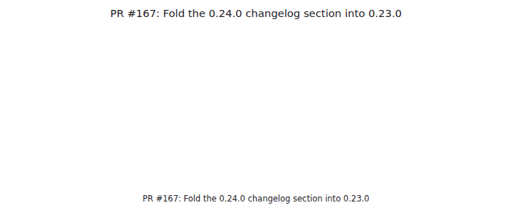
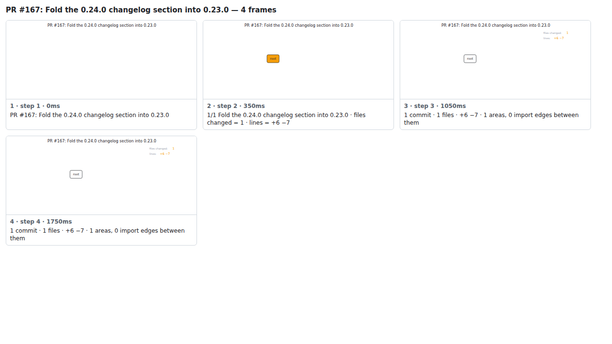

## PR #167: Fold the 0.24.0 changelog section into 0.23.0



<details><summary>Every step</summary>



```
PR #167: Fold the 0.24.0 changelog section into 0.23.0 — 4 steps, 1960ms, 7 nodes
 1. [    0ms] PR #167: Fold the 0.24.0 changelog section into 0.23.0
 2. [  350ms] 1/1 Fold the 0.24.0 changelog section into 0.23.0 · files changed = 1 · lines = +6 −7
 3. [ 1050ms] 1 commit · 1 files · +6 −7 · 1 areas, 0 import edges between them
 4. [ 1750ms] (end)
```

</details>

<sub>Generated by `vlmkit-anim pr`; the scene is [`change-map.scene.json`](./change-map.scene.json) — edit it and re-run `vlmkit-anim video` for a different cut, or `vlmkit-anim still` for the figure alone ([`change-map.svg`](./change-map.svg)).</sub>
