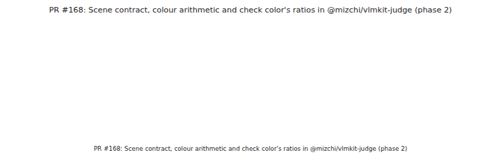
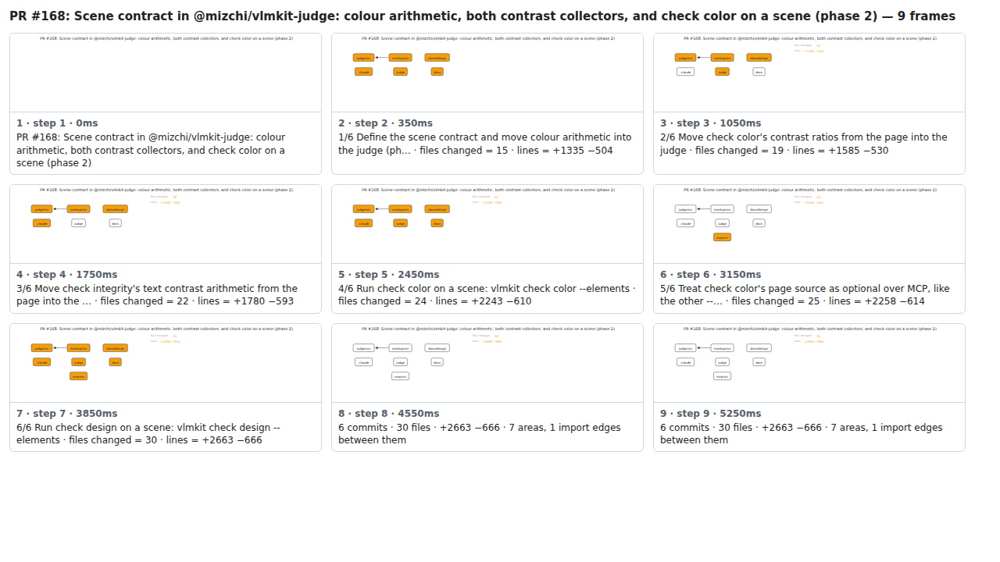

## PR #168: Scene contract in @mizchi/vlmkit-judge: colour arithmetic, both contrast collectors, and check color on a scene (phase 2)



<details><summary>Every step</summary>



```
PR #168: Scene contract in @mizchi/vlmkit-judge: colour arithmetic, both contrast collectors, and check color on a scene (phase 2) — 9 steps, 5460ms, 14 nodes
 1. [    0ms] PR #168: Scene contract in @mizchi/vlmkit-judge: colour arithmetic, both contrast collectors, and check color on a scene (phase 2)
 2. [  350ms] 1/6 Define the scene contract and move colour arithmetic into the judge (ph… · files changed = 15 · lines = +1335 −504
 3. [ 1050ms] 2/6 Move check color's contrast ratios from the page into the judge · files changed = 19 · lines = +1585 −530
 4. [ 1750ms] 3/6 Move check integrity's text contrast arithmetic from the page into the … · files changed = 22 · lines = +1780 −593
 5. [ 2450ms] 4/6 Run check color on a scene: vlmkit check color --elements · files changed = 24 · lines = +2243 −610
 6. [ 3150ms] 5/6 Treat check color's page source as optional over MCP, like the other --… · files changed = 25 · lines = +2258 −614
 7. [ 3850ms] 6/6 Run check design on a scene: vlmkit check design --elements · files changed = 30 · lines = +2663 −666
 8. [ 4550ms] 6 commits · 30 files · +2663 −666 · 7 areas, 1 import edges between them
 9. [ 5250ms] (end)
```

</details>

<sub>Generated by `vlmkit-anim pr`; the scene is [`change-map.scene.json`](./change-map.scene.json) — edit it and re-run `vlmkit-anim video` for a different cut, or `vlmkit-anim still` for the figure alone ([`change-map.svg`](./change-map.svg)).</sub>
