# vlmkit

<p align="center"></p>

Deterministic verification toolkit for frontend work: markup gates
(broken-page scan, copy fidelity, responsive boundaries, keyboard
operability, scripted flows), visual regression over time, design
audits, and repair tools. Built for humans and coding agents alike —
every failing gate prints a machine-parsable fix list. Everything is
key-free unless marked `[key]`.

Requires Node 24+.

## Quickstart — visual analysis with zero context

```bash
npm install -D @mizchi/vlmkit
npx playwright install chromium          # once

# 1. find concrete visual defects on the page you're working on
#    (no reference, no config, no API key — 3 viewports at once)
npx vlmkit check integrity http://localhost:3000/
#    -> verdict: DEFECTS … [page-overflow-x] @768: … main > p (right edge 924px)
#                          [text-collision] @1280: "Total: €1,240" overlaps "Refunds: €80"
#    fix what it names, re-run until: verdict: CLEAN

#    long-polling page: choose an earlier navigation milestone
npx vlmkit check integrity http://localhost:3000/ --wait-until domcontentloaded

# 2. track what your edits change visually (1st run = baseline, then diffs)
npx vlmkit snapshot http://localhost:3000/ --output .vlmkit/snapshots
#    -> desktop 13.11% … mobile 6.57% + diff heatmaps next to the report
#    intended? npx vlmkit snapshot approve --output .vlmkit/snapshots
```

From there: `check copy --manifest` (exact copy), `check breakpoints
--sweep` (responsive boundaries), `check interactions` (keyboard
operability), `verify markup --target design.png` (match a design) —
the full task-routing table, done-condition recipes, and agent
integration (MCP server + `markup-assist` skill) live in
**[`docs/markup-assist.md`](./docs/markup-assist.md)**.

## Demos

**[mizchi.github.io/vlmkit/demos/](https://mizchi.github.io/vlmkit/demos/)** — every feature on a page with a
known defect: the command, its whole output, and screenshots from the same run. Most pages are this
repository's own test fixtures, so each command works from a clone after `pnpm build`.

<!-- demos:start — generated by examples/demos/render.mjs -->
| | Demo | Command |
|---|---|---|
| <a href="https://mizchi.github.io/vlmkit/demos/integrity/">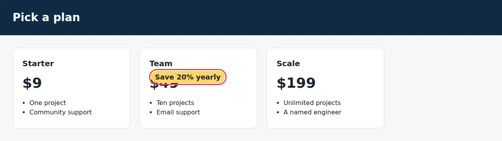</a> |  [A pricing page that breaks on smaller screens](https://mizchi.github.io/vlmkit/demos/integrity/) | `check integrity` |
| <a href="https://mizchi.github.io/vlmkit/demos/copy/">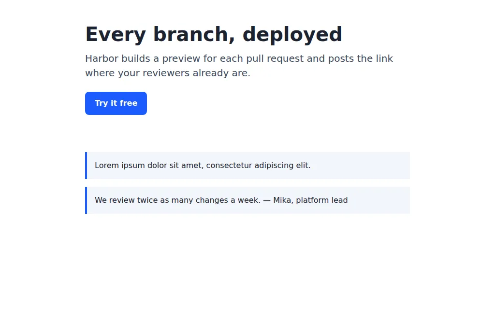</a> |  [Copy that drifted from the spec](https://mizchi.github.io/vlmkit/demos/copy/) | `check copy --manifest` |
| <a href="https://mizchi.github.io/vlmkit/demos/responsive/">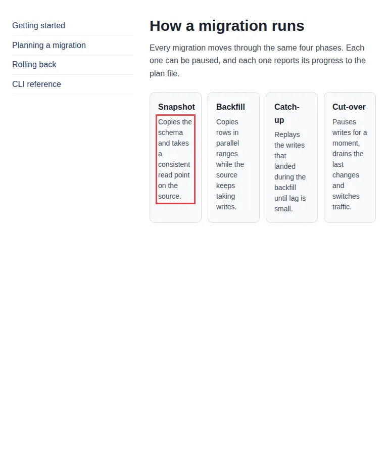</a> |  [A card grid that needs 826px, switched on at 768px](https://mizchi.github.io/vlmkit/demos/responsive/) | `check responsive` |
| <a href="https://mizchi.github.io/vlmkit/demos/interactions/">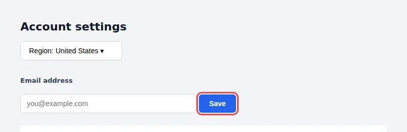</a> |  [A Save button that does nothing on Enter](https://mizchi.github.io/vlmkit/demos/interactions/) | `check interactions` |
| <a href="https://mizchi.github.io/vlmkit/demos/focus-order/">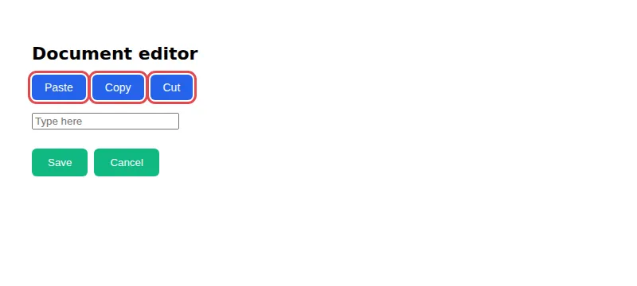</a> |  [A toolbar whose Tab order runs backwards](https://mizchi.github.io/vlmkit/demos/focus-order/) | `check a11y focus` |
| <a href="https://mizchi.github.io/vlmkit/demos/grounding/"></a> |  [A checkout button an agent would miss](https://mizchi.github.io/vlmkit/demos/grounding/) | `check grounding --mark` |
| <a href="https://mizchi.github.io/vlmkit/demos/contrast/">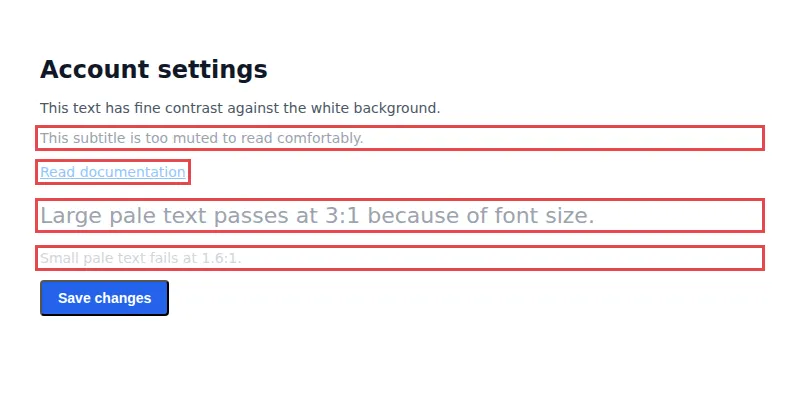</a> |  [Pale text that fails WCAG contrast](https://mizchi.github.io/vlmkit/demos/contrast/) | `check a11y contrast` |
| <a href="https://mizchi.github.io/vlmkit/demos/a11y-tree/">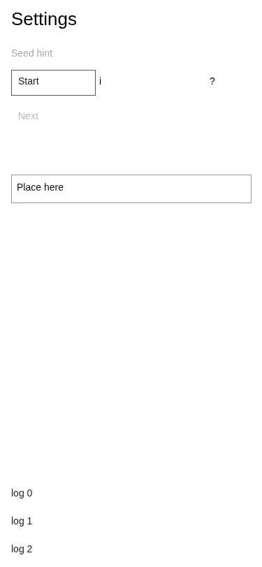</a> |  [An app with no DOM to read](https://mizchi.github.io/vlmkit/demos/a11y-tree/) | `scan a11y → check a11y tree` |
| <a href="https://mizchi.github.io/vlmkit/demos/composition/">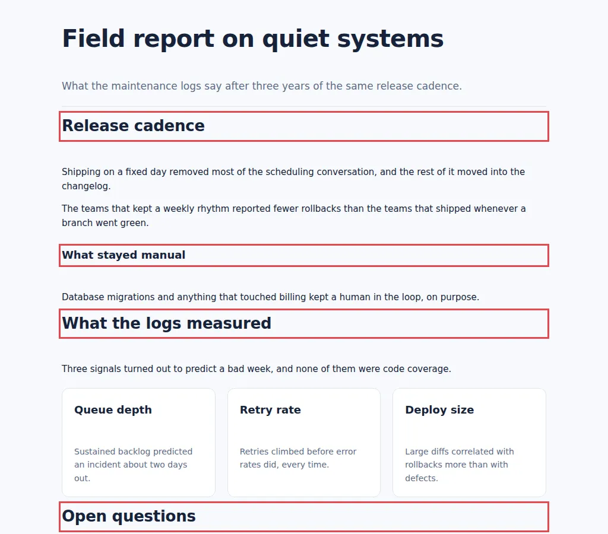</a> |  [Headings that sit closer to the section above](https://mizchi.github.io/vlmkit/demos/composition/) | `check composition` |
| <a href="https://mizchi.github.io/vlmkit/demos/color/">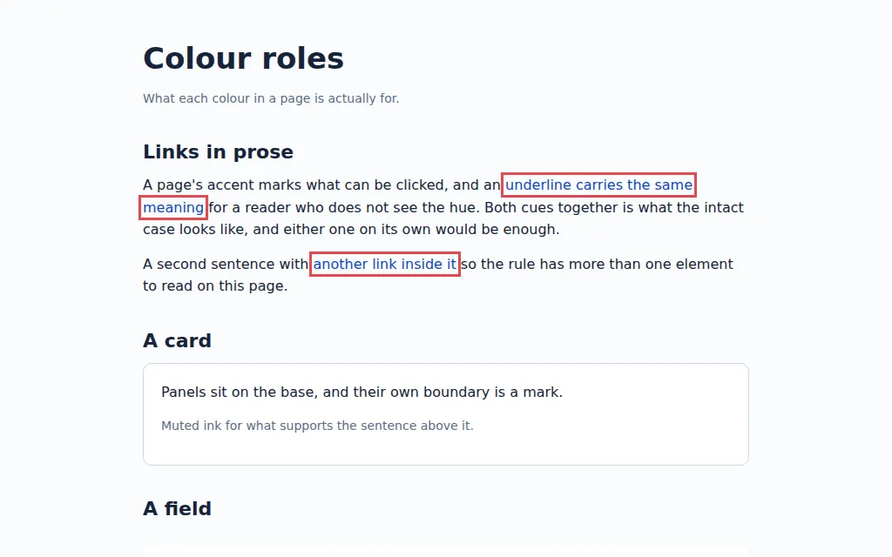</a> |  [Links you can only tell apart by colour](https://mizchi.github.io/vlmkit/demos/color/) | `check color` |
| <a href="https://mizchi.github.io/vlmkit/demos/tokens/">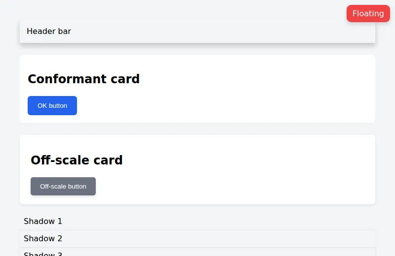</a> |  [Spacing and radii off the design scale](https://mizchi.github.io/vlmkit/demos/tokens/) | `check tokens` |
| <a href="https://mizchi.github.io/vlmkit/demos/diff/">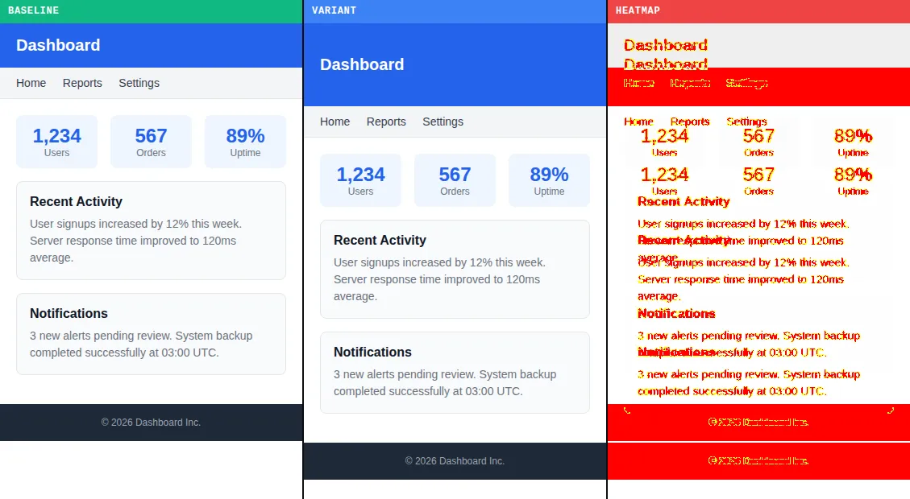</a> |  [A header that grew 48px and pushed everything down](https://mizchi.github.io/vlmkit/demos/diff/) | `diff html` |
| <a href="https://mizchi.github.io/vlmkit/demos/i18n/">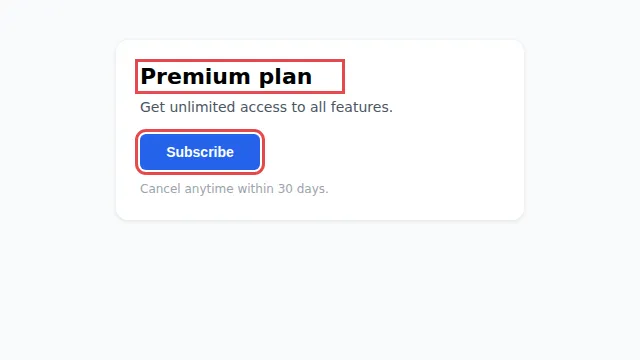</a> |  [Buttons that overflow when the copy gets longer](https://mizchi.github.io/vlmkit/demos/i18n/) | `stress i18n` |
| <a href="https://mizchi.github.io/vlmkit/demos/zoom/">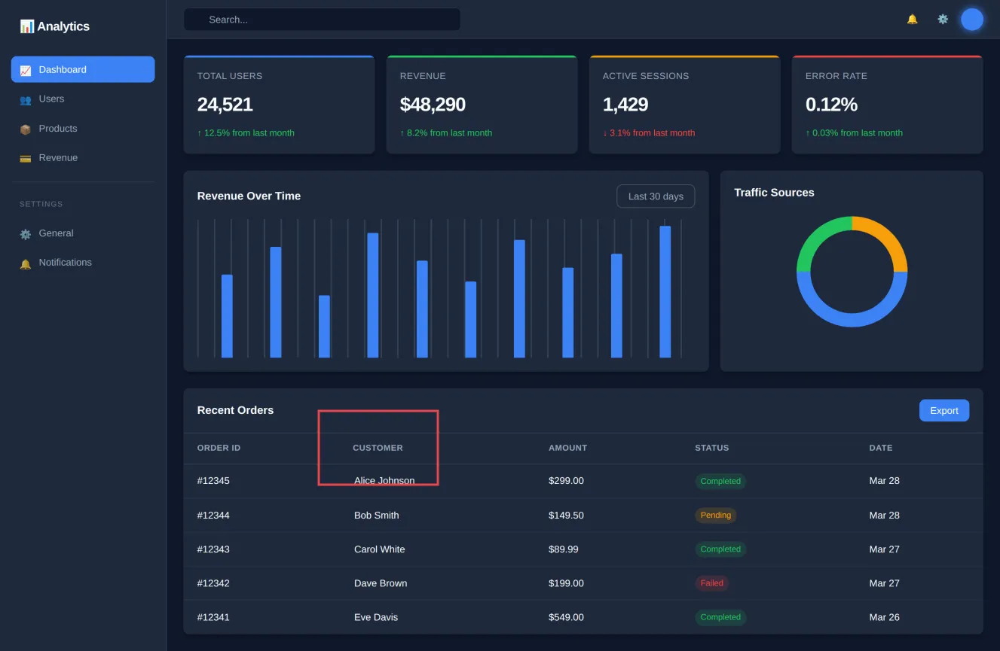</a> |  [Letting a vision model zoom into the original](https://mizchi.github.io/vlmkit/demos/zoom/) | `@mizchi/vlmkit-ai/zoom.ts` |
<!-- demos:end -->

Six whole sites built by agents, each beside the log of how it was judged, are at
[/sites/](https://mizchi.github.io/vlmkit/sites/).

## Setup

```bash
npm install -D @mizchi/vlmkit     # or -g
npx playwright install chromium   # once
```

vlmkit declares `playwright` as a peer and `@playwright/test` as an optional
peer, reusing the versions already selected by the project instead of
installing a second browser build.

- **Coding agents (MCP)** — `.mcp.json`:
  `{ "mcpServers": { "vlmkit": { "command": "npx", "args": ["-y", "@mizchi/vlmkit", "mcp"] } } }`
- **Agent skill** — install the automatic `vlmkit` router once with APM or the
  open `skills` CLI (commands below), then ask for the result in natural language.
- **API keys** — only for `[key]` features (`heal markup`,
  `check copy --vlm`, fix-loop): `OPENROUTER_API_KEY` /
  `GEMINI_API_KEY` / `ANTHROPIC_API_KEY`.
- **Snapshot / CI config** — `vlmkit.config.json` (routes, thresholds)
  via `vlmkit workflow init`.

Full setup detail: [`docs/configuration.md`](./docs/configuration.md).

### Install agent skills

Recommended: install the `vlmkit` skill package once. You do not choose a
specialized skill; the agent classifies each frontend request, loads the
matching bundled workflow, runs its deterministic gates, fixes failures, and
reruns to green.

```bash
# Install or update APM (macOS / Linux)
curl -sSL https://aka.ms/apm-unix | sh

# Install vlmkit with APM
apm install mizchi/vlmkit

# Or install with the skills CLI (APM is not required)
npx skills add mizchi/vlmkit
```

Inside Claude Code the same package installs as a plugin — no shell, and
`/plugin marketplace update` picks up new workflows:

```
/plugin marketplace add mizchi/vlmkit
/plugin install vlmkit@vlmkit
```

The APM bootstrap above is the [official recommended installer](https://microsoft.github.io/apm/getting-started/installation/)
and resolves the latest binary for the current platform. It avoids depending on
a stale package-manager formula.

Then ask naturally: “implement this mock,” “check this page's responsive and
keyboard behavior,” or “turn this story into stable Playwright tests.” There is
no skill-selection step in the normal workflow. On first use, the agent detects
the repository's package manager, reuses or adds `@mizchi/vlmkit` locally, and
installs Chromium only if a selected gate reports it missing.

All three installers expose one visible `vlmkit` skill. The 13 specialized
workflows are internal resources bundled under that entry, so the agent selects
them without adding 13 separate skills or copying the vlmkit source repository.

See the [agent skill catalog](./.claude/skills/README.md) for all 13
specialized skills, grouped by general verification, UI creation, test
generation, comparison and monitoring, and evaluation and hardening.
Explanation and figures (animations, D2 diagrams and slides)
live in [mizchi/explainer](https://github.com/mizchi/explainer).

## When to use what

`vlmkit --help` prints this same map. Everything is key-free unless
marked `[key]`.

| You want to… | Reach for |
|---|---|
|  Check the page you just wrote/edited, no reference | `check integrity` (broken-page scan, 3 viewports) · `check copy --manifest` (copy present, visibly, verbatim) · `check layout --contract` · `scan scroll` / `scan handlers` |
|  Verify behavior, not pixels | `check breakpoints --sweep` · `check responsive` (every width, shrunk to breakpoint + declaration) · `check interactions` · `check scroll` / `check animation` · `verify flow --flow` |
|  Drive the page from a screenshot (computer use) | `check grounding` — action map in screenshot px, which element a click at each point actually reaches, `--mark` for a numbered overlay |
|  Match a target design | `verify markup --target` (done verdict + fix list) · `build page` / `build component` · `scan mock` (normalize @2x exports) |
|  Track changes over time (VRT) | `snapshot` (baseline → per-viewport diff → `snapshot approve`) · `watch` · `diff-pr` · `baseline` |
|  Compare two versions | `diff html\|png\|elements` · `migration compare` · `check equivalence --region` |
|  Audit design quality | `check tokens\|theme\|palette` · `check design` (is the page consistent with itself — one button style or six) · `check a11y contrast\|touch\|focus` · `check perf` · `check drift` · `stress i18n\|media` |
|  Vet an image asset before it enters a slot | `check asset --slot --expect-transparent --against-bg --page-palette` |
|  Repair | `heal selector` (dead selector) · `heal markup` `[key]` (LLM auto-fix from a kickback) |
|  Run gates over a whole site | `batch --gate "check integrity" "routes/**/*.html"` (parallel, `--shard i/n`, per-job timing) · `gates run` (same, from one reviewed config) |
|  Audit what has been silenced | `gates suppressions` — every suppression with reason, owner, expiry; expired ones stop applying |
|  Wire into agents / pipelines | `mcp` (gate tools over stdio) · `contract` · `workflow` · `markup-loop` · `api` · `bench` · `skill` |

Task-routing recipes and done-condition sets:
[`docs/markup-assist.md`](./docs/markup-assist.md).

## The workspace

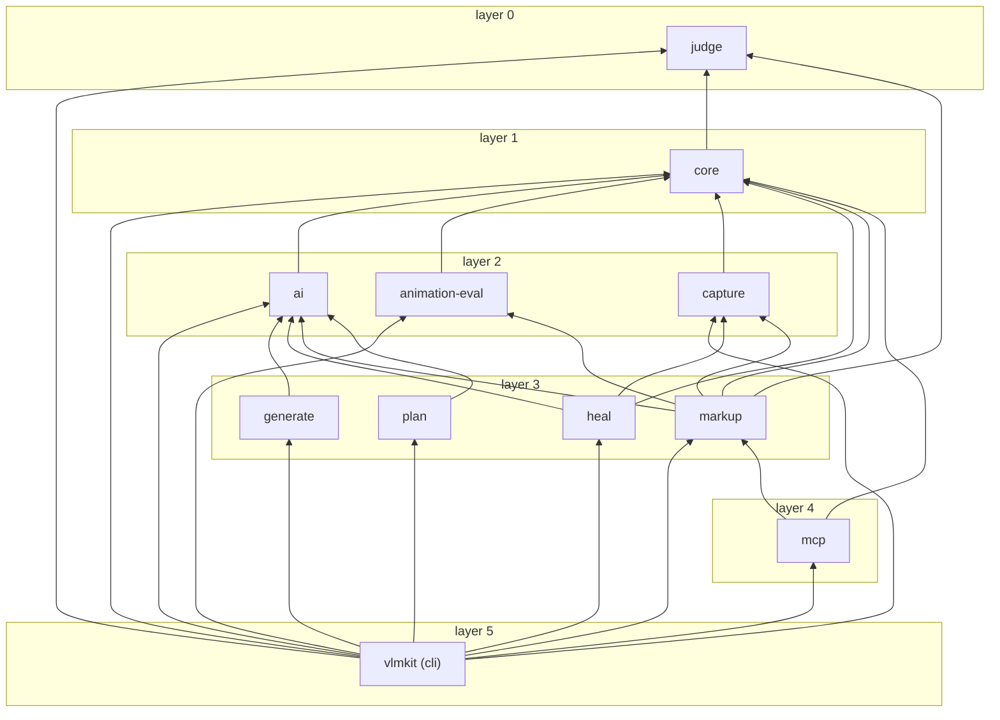

Eleven packages, layer by layer from `judge` (no dependencies) to the CLI; an arrow points from a
package to one it depends on. Generated from the manifests by `scripts/workspace-map.mjs`,
and a test fails when this block drifts from them.

## Examples

| | Example | What it shows |
|---|---|---|
|  | [Feature demos](./examples/demos/) | One page per feature: a page with a known defect, the command that finds it, its output and screenshots |
|  | [Demo sites](./examples/sites/) | Six sites built by agents with vlmkit's gates, each published beside the log of how it was judged |
|  | [Component-focused VRT](./examples/story-gallery/) | `check story` on one component instead of a whole page, with a gallery to copy |
|  | [Markup loop project](./examples/markup-loop-project/) | A minimal standalone project that reproduces the drop-in markup loop |
|  | [Markup VRT eval](./examples/markup-vrt-eval/) | A dogfood harness that measures the Playwright workflow while a new screen is built |
|  | [Gate plugin](./examples/gate-plugin/) | A project that adds two gates of its own through `vlmkit.config.json` |
|  | [Solitaire](./examples/solitaire/) | Klondike in plain HTML/CSS/JS, the drag-and-drop and animation dogfood target |
|  | [Intro page](./examples/vlmkit-intro-page/) | The dependency-free landing page, verified with vlmkit's own loop |

## Documentation

| Doc | Contents |
|---|---|
| [`docs/introduce.md`](./docs/introduce.md) | What is vlmkit? — narrative introduction assuming zero context |
| [`docs/markup-assist.md`](./docs/markup-assist.md) | Task-routing guide: which gate for which job, done-condition recipes, anti-gaming rules |
| [`docs/cli-reference.md`](./docs/cli-reference.md) | Complete command reference: all groups, examples, workflow/API/HTTP, architecture, project structure |
| [`docs/configuration.md`](./docs/configuration.md) | Install, MCP/skill setup, environment variables, snapshot/CI config, agent skills catalog |
| [`packages/vlmkit-mcp/README.md`](./packages/vlmkit-mcp/README.md) | MCP tool table |
| [`docs/knowledge.md`](./docs/knowledge.md) · [`docs/reports/`](./docs/reports/) | Accumulated evaluation findings and dated experiment reports |
| [`CHANGELOG.md`](./CHANGELOG.md) | Release notes, including the 0.4.x → current command mapping |

## License

MIT
