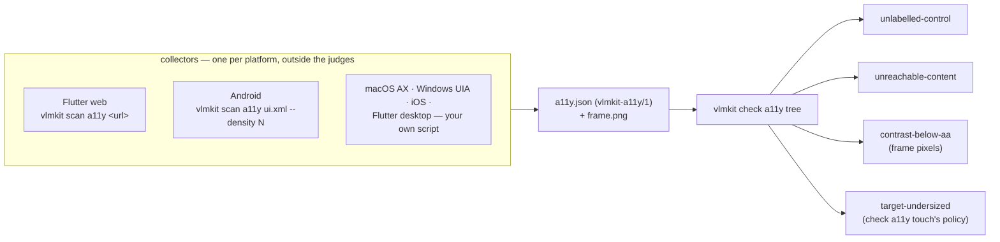

# Accessibility from a platform tree (`vlmkit-a11y/1`)

`vlmkit check a11y touch|contrast|focus` read a browser's DOM. A Flutter app, an Android or iOS
app, a macOS or Windows desktop app has no DOM worth reading. Flutter web does have a DOM, but
it paints nothing into it. What each of these platforms *does* have is an accessibility tree
and a screen. `vlmkit-a11y/1` is that pair as a file. Two gates work with it:

- `vlmkit scan a11y` writes one from a Flutter web page or an Android `uiautomator dump`.
- `vlmkit check a11y tree` judges it, from any platform, with no browser.



```bash
# Flutter web: the semantics tree is switched on before the app starts, no served-copy injection
vlmkit scan a11y https://example.com/app/ --out a11y.json
vlmkit scan a11y https://example.com/app/ --click Practice --click Start --out game.json
vlmkit check a11y tree a11y.json

# Android
adb shell uiautomator dump /sdcard/ui.xml && adb pull /sdcard/ui.xml
adb exec-out screencap -p > frame.png
vlmkit scan a11y ui.xml --density "$(adb shell wm density | grep -o '[0-9]*$')" --frame frame.png --out a11y.json
vlmkit check a11y tree a11y.json
```

## The file

```json
{
  "format": "vlmkit-a11y/1",
  "platform": "flutter-web",
  "viewport": { "width": 375, "height": 812 },
  "scale": 2,
  "frame": "a11y.png",
  "nodes": [
    { "path": "n0", "role": "group", "rect": { "left": 0, "top": 0, "width": 375, "height": 812 } },
    { "path": "n0>n6", "role": "button", "name": "Standard",
      "rect": { "left": 16, "top": 438, "width": 114, "height": 32 },
      "states": { "selected": true }, "actions": ["tap"] },
    { "path": "n0>n28>textarea[0]", "role": "textfield",
      "rect": { "left": 8, "top": 100, "width": 130, "height": 26 }, "states": { "disabled": true } }
  ]
}
```

| field | meaning |
|---|---|
| `viewport` | The visible area in **viewport units**: CSS px on the web, dp on Android, pt on Apple platforms. WCAG's target floors are written in these units. |
| `scale` | Frame pixels per viewport unit. The default is frame width / viewport width. |
| `frame` | The screenshot taken with the tree, relative to the tree file. `--image` overrides it. |
| `path` | Unique. Ancestry comes from its prefixes (`a>b` is inside `a`), as in the scene contract. |
| `role` | One of `button link textfield checkbox radio switch slider tab menuitem combobox heading text image group list listitem dialog scrollview window`, or the platform's own role when there is no mapping. |
| `name` | What a screen reader announces. A text field's content is `value`, never `name`. |
| `states` | `disabled focused checked selected expanded hidden`. |
| `actions` | `tap longPress scroll focus setText`, or anything else the platform reports. `scroll` on a node, or `role: scrollview`, makes everything inside it reachable. |
| `textSize`, `fontWeight` | Optional. When absent, contrast measures the text height from the frame. |

**The collector resolves, the judge decides.** A collector maps its platform's roles and units
onto these fields and reports facts. It never reports a verdict, such as a contrast ratio. A
collector for another platform is a script that walks that platform's accessibility API and
writes this JSON:

- **macOS:** `AXUIElement`, via `AXRole`, `AXTitle`/`AXDescription`, `AXFrame` and `AXEnabled`.
- **Windows:** UI Automation, via `ControlType`, `Name`, `BoundingRectangle` and `IsEnabled`.
- **iOS:** the XCUITest hierarchy.
- **Flutter on any platform:** a `SemanticsNode` dump.

Nothing in `check a11y tree` knows which platform wrote the file.

## The rules

| rule | fires on | WCAG |
|---|---|---|
| `unlabelled-control` | An operable node (an interactive role, or a `tap`/`setText`/`longPress` action) with no name, and no named descendant to take one from. Disabled controls are judged too: 4.1.2 has no inactive exemption. | 4.1.2 |
| `unreachable-content` | Named or operable nodes outside the viewport with no scrolling ancestor. One finding per container, with the count, because 35 log lines past the fold are one defect. | — |
| `contrast-below-aa` | Text under 4.5:1, or under 3:1 for text of 24 units (18.66 bold). The background is the rect's most common colour. The ink is the most contrasting glyph colour, after outlines, rules and underlines are dropped. Disabled nodes are listed as exempt. Needs a frame. | 1.4.3 |
| `target-undersized` | `check a11y touch`'s own policy, including its spacing exception, applied to the tree's operable nodes. A small control inside an operable ancestor that meets the floor is judged as that ancestor and listed as `enclosed`. | 2.5.8 / 2.5.5 |

`--allow '<path-or-"name">;<reason>'` exempts one node from every rule. It matches the node's
path or its quoted name. A rule that matches nothing is reported.

## Why contrast is measured in pixels

Flutter web's accessibility DOM is transparent by construction (`filter: opacity(0%)`), so
every computed colour is `rgba(0,0,0,0)`. On ofc-app this made `check integrity`'s contrast
rules report every label at 1.00:1, all eight of them false positives. The project turned the
rules off and wrote its own pixel audit. Paint here comes only from the frame.

Measuring pixels raised two problems. Both were found on ofc-app, and both are handled:

- **A chip's outline is not its text.** When the outline counted as ink, the three mode chips
  measured as 35.6-unit text, which is large text with the lenient 3:1 floor. The outline could
  also stand in for the label's colour. Ink is therefore split into connected components, and a
  component that spans the rect is dropped when it is thin (a rule or an underline) or spans the
  height too (an outline).
- **A tight text rect is its text.** Width alone is not a line. A `"7♥"` card label fills its
  own rect, and dropping every width-spanning component made it read as blank.

Text size comes from the tallest run of inked rows, divided by 0.9. An estimate that errs low
applies the stricter 4.5:1 floor.

## Measured on a real app

Measured on ofc-app ([whywaita/ofc-app#36](https://github.com/whywaita/ofc-app/pull/36)), the
Flutter web project whose hand-written workarounds this replaces:

- **Pre-fix build** (`6aaf448`, built with Flutter 3.47.5, captured at 375x812 and 375x568):
  - `Game Mode` at 4.38:1 (their audit reported 4.39:1).
  - The seed line's unlabelled, disabled `<textarea>`.
  - Every red card label at 3.68:1: `#F44336` on white, 14px text. This finding is new. The
    project's own audit could not see it, because it took the text size from the rect's height,
    so a 40x30 card counted as large text with a 3:1 floor.
- **Deployed fix:**
  - `Game Mode` at 5.89:1.
  - The red cards still at 3.68:1.
  - The 17px "Place in …" buttons are listed as enclosed by their 35px tappable rows, not as
    failures.

The fourth pre-fix defect, the unreachable Action Log, is on the result screen. The pre-fix
build could reach that screen only by dragging, and `--click` cannot drag. The fixture
(`fixtures/a11y-tree/flutter-like.html`) and the Android test cover the rule instead. Details
are in `docs/reports/2026-09-25-a11y-tree-v1.md`.
