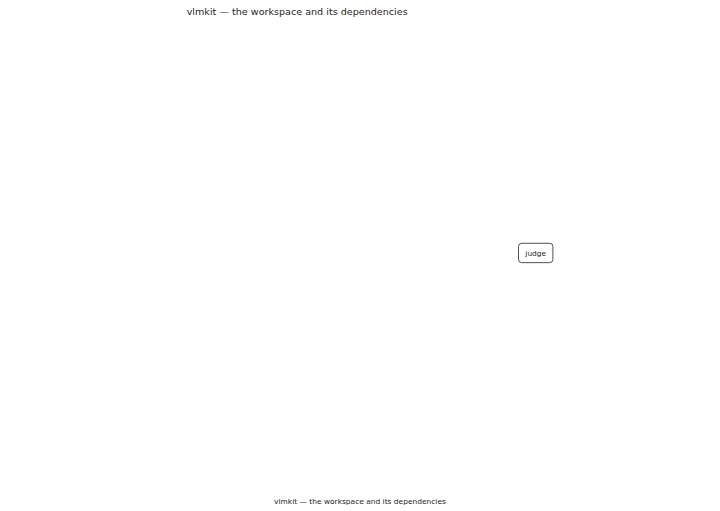
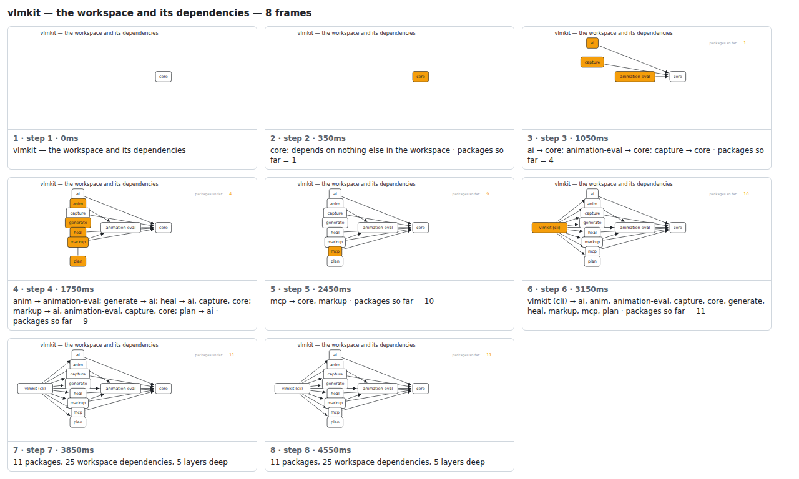

## vlmkit — the workspace and its dependencies



<details><summary>Every step</summary>



```
vlmkit — the workspace and its dependencies — 8 steps, 4760ms, 40 nodes
 1. [    0ms] vlmkit — the workspace and its dependencies
 2. [  350ms] core: depends on nothing else in the workspace · packages so far = 1
 3. [ 1050ms] ai → core; animation-eval → core; capture → core · packages so far = 4
 4. [ 1750ms] anim → animation-eval; generate → ai; heal → ai, capture, core; markup → ai, animation-eval, capture, core; plan → ai · packages so far = 9
 5. [ 2450ms] mcp → core, markup · packages so far = 10
 6. [ 3150ms] vlmkit (cli) → ai, anim, animation-eval, capture, core, generate, heal, markup, mcp, plan · packages so far = 11
 7. [ 3850ms] 11 packages, 25 workspace dependencies, 5 layers deep
 8. [ 4550ms] (end)
```

</details>

<sub>Generated by `vlmkit-anim pr`; the scene is [`vlmkit-architecture.scene.json`](./vlmkit-architecture.scene.json) — edit it and re-run `vlmkit-anim video` for a different cut.</sub>
