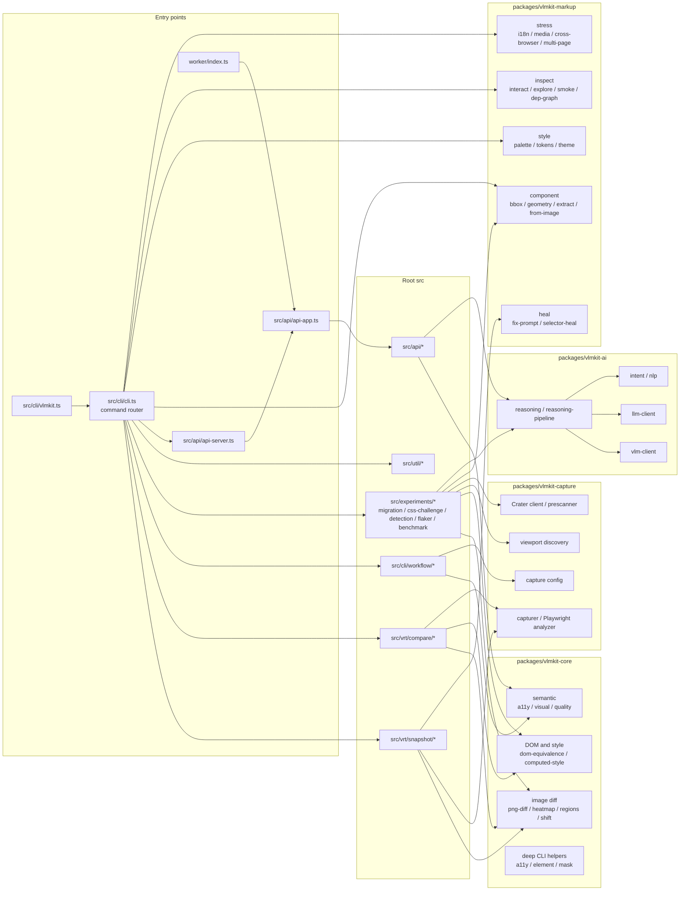
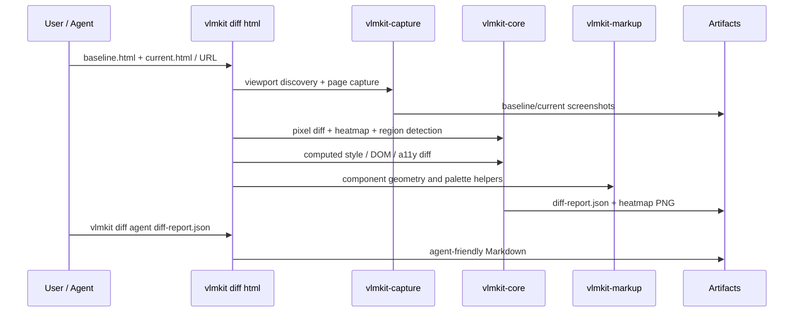

# vlmkit project structure diagram

作成日: 2026-05-19

## 生成済み画像

- [全体構成 PNG](./assets/vlmkit-project-structure-1-overview.png)
- [Package / source boundary PNG](./assets/vlmkit-project-structure-2-package-boundary.png)
- [visual diff flow PNG](./assets/vlmkit-project-structure-3-visual-diff-flow.png)

## 全体構成

```mermaid
flowchart TB
  user["User / Coding Agent"]

  subgraph cli["CLI: @mizchi/vlmkit"]
    vlmkit["vlmkit"]
    diff["diff\nhtml / png / elements / browsers / agent / runs"]
    snapshot["snapshot\ncapture / approve / stability / report / flipbook / fix-prompt"]
    check["check\na11y / tokens / theme / perf / drift"]
    inspect["inspect\ninteract / explore / smoke"]
    markup_cli["build / scan / stress\ncomponent / breakpoints / i18n / media"]
    migration["migration\ncompare / blind / subagent"]
    labs["bench / report\nCSS challenge lab"]
    api_cli["api\nserve / status"]
    workflow["workflow\ninit / capture / verify / approve"]
  end

  subgraph api["HTTP API / Worker"]
    hono["Hono API app"]
    openapi["OpenAPI"]
    compare_api["/api/compare"]
    renderers_api["/api/compare-renderers"]
    reason_api["/api/reason"]
    smoke_api["/api/smoke-test"]
    worker["Cloudflare Worker entry"]
  end

  subgraph packages["Workspace packages"]
    core["@mizchi/vlmkit-core\nPNG diff / heatmap / DOM / style / a11y / quality"]
    capture["@mizchi/vlmkit-capture\nPlaywright / Crater / viewport discovery / config"]
    markup["@mizchi/vlmkit-markup\ncomponent / design tokens / theme / inspect / stress / heal"]
    ai["@mizchi/vlmkit-ai\nVLM / LLM clients / reasoning / intent"]
  end

  subgraph backends["External backends"]
    playwright["Playwright Chromium"]
    crater["Crater BiDi"]
    cloudflare["Cloudflare Browser Rendering"]
    llm["OpenRouter / Gemini / Anthropic"]
    storage["R2 / KV / D1 bindings"]
  end

  subgraph outputs["Artifacts"]
    pngs["baseline / current / heatmap PNG"]
    json["diff-report.json\nsnapshot-report.json\nstability-report.json"]
    md["agent Markdown\nfix prompt\nsummary report"]
    html["flipbook HTML"]
    baselines["baselines / snapshots / approval manifests"]
  end

  user --> vlmkit
  vlmkit --> diff
  vlmkit --> snapshot
  vlmkit --> check
  vlmkit --> inspect
  vlmkit --> markup_cli
  vlmkit --> migration
  vlmkit --> labs
  vlmkit --> api_cli
  vlmkit --> workflow

  api_cli --> hono
  hono --> openapi
  hono --> compare_api
  hono --> renderers_api
  hono --> reason_api
  hono --> smoke_api
  worker --> hono

  diff --> core
  snapshot --> core
  check --> core
  workflow --> core
  migration --> core
  labs --> core
  compare_api --> core

  diff --> capture
  snapshot --> capture
  workflow --> capture
  renderers_api --> capture
  smoke_api --> capture

  check --> markup
  inspect --> markup
  markup_cli --> markup
  migration --> markup
  smoke_api --> markup

  reason_api --> ai
  migration --> ai
  labs --> ai

  capture --> playwright
  capture --> crater
  capture --> cloudflare
  ai --> llm
  worker --> storage

  core --> pngs
  core --> json
  markup --> md
  snapshot --> html
  workflow --> baselines
```

## Package / source boundary

## 代表フロー: visual diff から agent 用レポートまで

## 読み方

- `@mizchi/vlmkit-core` は比較の最小単位を持つ層。
- `@mizchi/vlmkit-capture` は browser / renderer 依存を隔離する層。
- `@mizchi/vlmkit-markup` は UI を理解・検査・再構成する補助層。
- `@mizchi/vlmkit-ai` は VLM/LLM reasoning の任意拡張層。
- `src/experiments/*` 由来の CLI は価値が高いが、安定 API というより labs として扱う。
