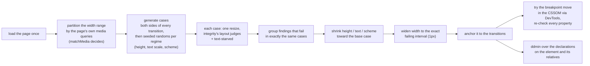

# Responsive layout as a property-based test — `check responsive` v1

2026-09-26

The demo-site round (`2026-09-23-demo-sites-v1.md`) found 17 defects in one class by eye
and by no gate: **cramped or wrapped layout at in-between widths**. The magazine's masthead
set 暮 / ら / し a character per line at 768px while `check integrity` called 768 clean; the
docs' four phase cards sat at 93px each in a 432px article. Both gates that look at width
were run on those pages and passed. `check integrity` renders three widths someone chose;
`check breakpoints` renders each boundary's B−1 / B / B+1 and asks whether they agree. Neither
asks whether the layout a regime selects **fits anywhere inside it**.

This round treats the viewport as a generated input and the layout judges as properties,
and shrinks every failure before reporting it — to the width range it fails over, the
breakpoint that bounds it, and the declaration that causes it.

**Headline:** on eleven paired mutants of classic responsive patterns, `check responsive`
reported **11 of 11** with the right anchor and cause; `check integrity` reported 3 and
`check breakpoints --sweep` 4. On the demo sites, with their recorded fixes reversed, it
found both eye-only defects in its class (magazine D30, docs D24) that the other two gates
pass, and **verified** the breakpoint move for each. Across the 11 intact patterns and the
11 published pages it has **no false positive** — after one, found on the magazine's
headline and fixed by a rule change this report explains.

## What it does



- **Partition.** Every media condition — CSSOM rules, `@import`, `<link media>`, `<source
  media>`, and cross-origin sheets through the DevTools protocol — is evaluated with
  `matchMedia` across the width range. Where the matching set changes is a transition;
  between two is a regime. The conditions' numbers only seed the sampling (with ±1 around
  each, and an 80px grid for anything that does not parse); a change no number predicted is
  bisected to the pixel. So `em`, range syntax, `767.98px` and `not` partition correctly.
- **Generate.** Both sides of every transition and both ends of the range come first — a
  one-pixel orphan width is one width in ~1100 to uniform sampling and certain here — then
  seeded random cases visit the regimes round-robin, a quarter of them on a regime edge.
  Height varies in half the cases; text scale (`--text-scale 2`, root font size ×1…×2),
  colour scheme and reduced motion vary when the page reacts to them.
- **Check.** One resize of one loaded page per case, never a reload, and the finite
  transitions the resize starts are finished before measuring. The properties are
  `check integrity`'s layout judges — `page-overflow-x`, `clipped-content`,
  `text-collision`, `text-clipped`, `container-protrusion`, `occluded-text`,
  `collapsed-container` — run through the same collectors and pure judges, plus
  **`text-starved`**, the class the eye kept finding.
- **Shrink.** Findings that fail in exactly the same cases are one group (five nav links
  starved together are one defect in the row that holds them). Each group is shrunk in
  QuickCheck's way over every dimension but width, so `needs height=578` means it only
  happens on a short screen; then its width is widened to the exact failing interval by
  galloping and bisection; then the interval is anchored.
- **Anchor → move.** A failure that begins exactly at a transition and clears inside the
  next regime is a breakpoint switched on too early; one that clears exactly at a transition
  is a layout kept too long. The implied move is **tried**: the conditions on both sides of
  the transition are rewritten with `CSS.setMediaText`, the interval re-checked, and every
  property re-checked there. `verified` means the failure clears and nothing new fails.
- **Cause.** The failing element, four ancestors, its flex/grid siblings and three levels
  of descendants are tagged; `CSS.getMatchedStylesForNode` gives each one's winning author
  declarations in cascade order. Each sizing or wrapping declaration is overridden to a
  neutral value (`min-width: auto`, `flex-wrap: wrap`, `grid-template-columns: none`, …)
  and the failure re-checked; ddmin runs when no single one suffices.

Deterministic for a seed (default 1), and every failure carries a `--width … --height …`
replay line.

## Paired mutants: eleven patterns, one break each

`fixtures/responsive-patterns/`: each pattern built the way it is meant to be built, and a
mutant that is the pattern plus one change: three reproduce a demo-site defect directly, the rest a variant of one or a constructed break of the same kind. Default settings
(60 cases); the toolbar with `--text-scale 2`.

| mutant | reproduces | `check integrity` | `check breakpoints --sweep` | `check responsive` |
|---|---|---|---|---|
| masthead--row-too-early | magazine D30 (direct) | — | — | `text-starved` 560–771, starts at 560, move → 772 verified, cause `flex-wrap: nowrap` in the 560px query |
| card-grid--fixed-four | docs D24 (direct) | — | — | `text-starved` 768–825, move → 826 verified, cause `grid-template-columns: repeat(4, …)` in the 768px query |
| sidebar-layout--rigid-article | constructed: a fixed-minimum column once the sidebar joins | `page-overflow-x`@768 | `overflow-at-boundary`, `sweep-overflow` | `page-overflow-x` 768–882, move → 883 verified, cause `min-width: 38rem` |
| data-table--clipped-scroller | dashboard D5, variant: the scroller clips | — | — | `clipped-content` 600–690, move verified, cause the table's `min-width: 640px` (a descendant) |
| form-row--rigid-input | shop D7 (direct) | `page-overflow-x`@375 | `sweep-overflow` | `page-overflow-x` 320–407, inside one regime, cause `flex-wrap: nowrap` |
| media-object--rigid-price | checkout D1 / D3, variant: a rigid price column | — | `sweep-overflow` | `page-overflow-x` 320–374 and `text-starved` 320–417, cause `flex-basis: 11rem` (on 2 elements) |
| hero--fixed-height | constructed: a viewport-height hero | — | — | `clipped-content`, **needs height=578**, cause `height: 100vh` |
| drawer--peeking | constructed: a drawer sized in vw, pushed out in rem | — | — | `occluded-text` 498–767, cleared at 768, cause `width: 85vw` |
| pricing--orphan-width | the dogfood-dataviz fixture's off-by-one | `page-overflow-x`@768 | `boundary-spike`, `overflow-at-boundary` | `page-overflow-x` at exactly 768, a one-pixel regime, cause `grid-template-columns: repeat(3, 20rem)` |
| toolbar--fixed-height | constructed: WCAG 1.4.4 text resize | — | — | `text-clipped` at every width **once text is 2x**, cause `height: 36px` |
| container-card--early-row | constructed: a container query switched on too early | — | — | `text-starved` in three viewport ranges, cause `grid-template-columns` in the `@container` rule |
| **detected** | | **3 / 11** | **4 / 11** | **11 / 11** |

The eleven intact patterns: silent on all three gates. The test pins both halves
(`responsive-pbt.test.ts`, `responsive-patterns.test.ts`, 30 tests, ~85s).

What the other two gates cannot see is structural, not a threshold: seven of the eleven
defects produce no overflow at all — text squeezed, clipped inside a box, painted over, or
only on a short screen or at larger text — and `--sweep` reads only `scrollWidth`. The three
`check integrity` catches are the ones that happen to include 768 or 375.

## The demo sites, with their fixes reversed

The six published sites are clean now; the rounds fixed them. The fix records in each
`judgment.sqlite` say what was changed, so the defect can be put back: the fix undone by one
injected `<style>` in a copy of the site, the page measured as it was before its fix.

| defect | found by | `check integrity` | `check breakpoints --sweep` | `check responsive` |
|---|---|---|---|---|
| magazine D30 — masthead a character per line at 700–999px | eye | — | — | `text-starved` 700–977, starts at the 700px breakpoint; move → 978px verified (3 conditions, 9 rules rewritten) |
| docs D24 — four 93px phase cards at 768–1000px | eye | — | — | `text-starved` 768–825; move → 826 verified; cause the 4-column `grid-template-columns` |
| shop D7 — newsletter row 20px too wide at 320px | gate (`--sweep`) | — | `sweep-overflow` | `page-overflow-x` 320–338 |
| dashboard D5 — table cut to a sliver inside its scroller at 768 | eye | — | — | — |
| kanban D4 — "New task" drops to a third row at 375 | eye | — | — | — |

The two misses are outside the properties, by design rather than by threshold. D5 is a
table inside an `overflow-x: auto` scroller: sideways scrolling is a legitimate pattern, and
the defect was that the brief reserved it for phones — intent, not geometry. D4 is a flex
row that wraps a button onto its own line: correct wrapping, badly composed. Checkout D14,
the other in-class candidate, is on the confirmation screen, which the page does not show
on load; like most gates this one measures the loaded state.

Screenshots of both eye-only regressions, taken while writing this, show exactly what the
logs describe: `Catch- / up` and one- or two-word description lines in the phase cards, and
ほと / り, 暮 / ら / し, インタ / ビュー and a tall 検 / 索 pill in the masthead.

## Live corpus: 14 pages

The six sites' eleven published pages (docs ×3, shop, dashboard, magazine, checkout,
kanban, gallery), the landing page, solitaire, and the three `fixtures/css-challenge` pages.

- **One false positive, fixed.** The magazine's 42px headline at 1000–1015px, four lines
  of five characters in a 236px column (5.6em), fired the "under 6em over three or more
  lines" tier. In the picture it is a Japanese editorial title set in a narrow column on
  purpose. Display type now faces only the "under 4em" tier (`STARVED_DISPLAY_PX = 24`);
  the test holds the title silent and the same title at 120px still starved. After the
  change: **0 findings on all 11 published pages** and the landing page and solitaire.
- **Nine true positives on the css-challenge pages**, none of which was built for a 320px
  phone. `page.html`: the page scrolls sideways at 320–344 (the one `--sweep` also reports),
  and the branch bar's buttons wrap into `Go / to / file`, `Add / file / ▾` at 320–526 —
  looked at, and that is what they do. `dashboard.html`: the orders table at 769–810 wraps
  `Mar / 28` and `ORDER / ID` — the regime switched on at 769 does not fit until 811, move
  verified. `form-app.html`: the last tab sticks out of the tab bar at 320–339.

Cost: 7–15s per page at 60 cases (50–170ms per case, 0.3–0.8s partitioning, shrinking
0–9s depending on how many groups fail). `check integrity` took 3.7–4.2s and `check
breakpoints --sweep` 2.6–3.0s on the same pattern pages; `check responsive` 4.4–5.3s on an
intact pattern and 6–9.5s on a mutant, most of the difference being the shrink.

## Three things measured into the design

**The CSSOM cannot read the stylesheets that matter.** The first cause search walked
`document.styleSheets`. On the demo sites it reported "no declaration to test" for every
failure: a stylesheet linked from a `file:` page is cross-origin in Chromium (so is a CDN
one), and `cssRules` throws. `--allow-file-access-from-files` would have fixed the demo
case by giving the page under test read access to the disk; the DevTools protocol fixes
both cases and needs nothing from the page. It also gives the cascade the browser computed,
in order, so the first version's hand-written specificity calculator is gone, and
`CSS.setMediaText` edits a condition in place — which is what made the breakpoint move
checkable at all.

**The first declaration that clears a squeeze is usually `padding: 0`.** ddmin returns *a*
minimal set, and on the card grid that was the cards' padding: true, and useless. Candidates
are now ranked before any is tried — declarations inside the `@media` the failure is
anchored to (or inside an `@container`, when nothing anchors it) first; sizing and wrapping
before spacing; larger forced size first; the element before its relatives — and the first
**single** override that clears it wins, with up to two alternatives printed. The card grid
now names `grid-template-columns: repeat(4, …)` in the 768px query and lists the padding as
an alternative. A second defect in the same search: `flex-basis: 11rem` set by a later rule
over an earlier `flex: 0 0 auto` was being reported as the shorthand's value, naming the
rule it overrode; longhands now stand as their own candidates.

**A suggested breakpoint is a hypothesis.** Printing "move 768 to 826" would be a guess
dressed as a measurement. Rewriting the condition and re-running every property across the
interval turned every catalog suggestion into `verified` and one live one (magazine, before
the display-type fix) into "not tried": that sheet was unreadable until the protocol replaced
the CSSOM. A move that trades one failure for another is reported with what it introduces.

## Limits, stated

- **Loaded state only.** A layout reached by clicking (a checkout step, an open drawer, a
  dialog) is not measured. Pair with `verify flow` or measure a page that opens in that state.
- **Declarations, not intrinsic sizes.** shop D7's cause is an `<input>`'s intrinsic width,
  which no declaration sets; the search reports the button's padding, the single override
  that happens to clear it. `page-overflow-x`'s own message names the right element.
- **Container queries are followed, not partitioned.** Width changes drive them, so their
  failures are found (the container-card mutant), but no transition anchors them.
- **Not varied:** `hover`, `pointer`, `resolution`, `prefers-contrast` and friends. A
  regime selected only by one of those is reported as `untested-media-feature` (info).
- **`occluded-text` needs half the sampled glyph points covered** — integrity's calibrated
  threshold, kept. A drawer peeking 40px over a line's start is under it.
- **The stranded-last-line class** (27 of the demo sites' eye-found defects, the largest) is
  not a property here; the demo-sites report's candidate rule still needs its own paired
  mutants and corpus pass. `check responsive` is where it would run once it exists.

## Use

```sh
vlmkit check responsive page.html                    # 60 cases, seed 1
vlmkit check responsive page.html --text-scale 2     # also root font-size up to 2x
vlmkit check responsive page.html --width 768 --height 900   # replay a printed case
```

Library: `runResponsiveOnPage(page, { properties })` in
`@mizchi/vlmkit-markup/stress/responsive-pbt.ts` runs the same loop on a page a Playwright
test already opened, with the caller's own properties; the search primitives
(`createRng`, `shrinkRecord`, `failingInterval`, `minimizeSubset`) are pure, in
`@mizchi/vlmkit-judge/pbt.ts`.
