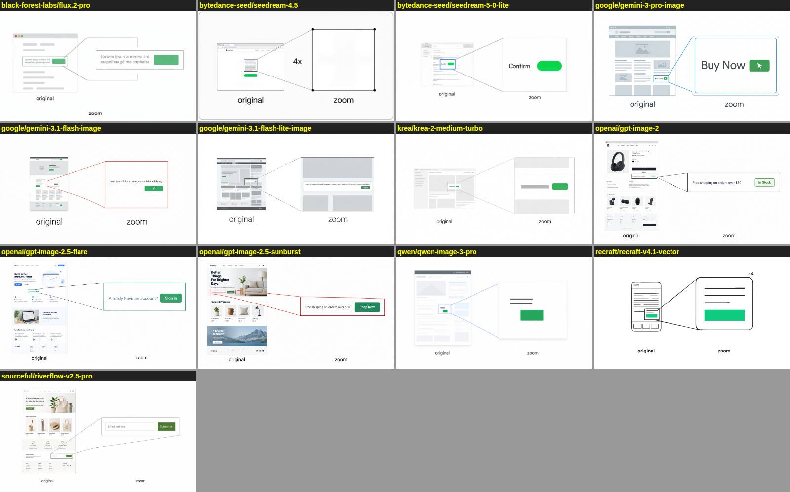
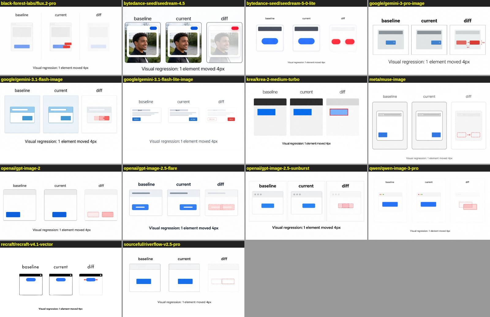
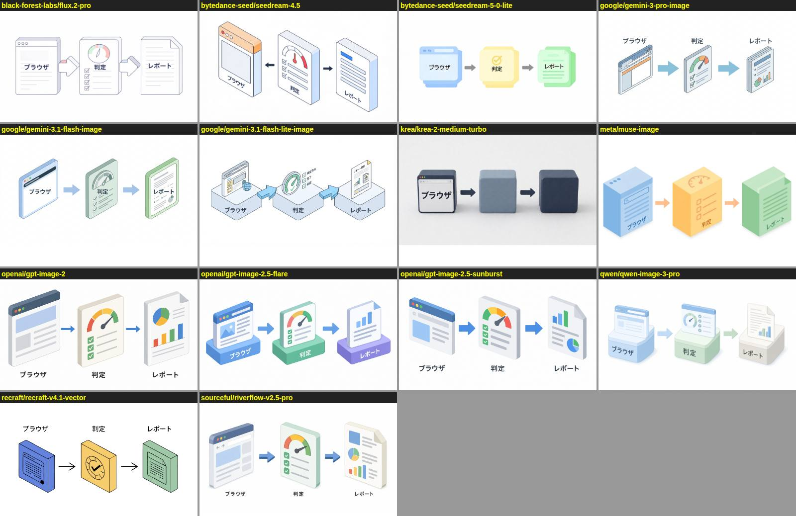

# Image generation models on OpenRouter: which one draws a figure we can use

Some figures do not fit mermaid, D2, vlmkit-anim or HTML: an illustration, a concept picture, a
page that has to look like a page. For those the policy is to generate the figure with Codex
imagegen or, when `OPENROUTER_API_KEY` is set, with an OpenRouter image model. Claude has no
image generation of its own; it can only write the code that draws a figure. This round picks the
OpenRouter model.

**Result: `openai/gpt-image-2.5-flare`, with `meta/muse-image` beside it.** Flare scored 3/3 on our
three figure briefs at the lowest price measured ($0.009–0.015 an image) and 11–15s per image.
Muse also scored 3/3 at a flat $0.010, taking 21–36s, and drew the most literal zoom of the round. Two other OpenAI models, `gpt-image-2`
and `gpt-image-2.5-sunburst`, also scored 3/3 at the same price, 4–7s slower. `gemini-3-pro-image`
and `riverflow-v2.5-pro` scored 3/3 at nine times the price, and Riverflow takes over a minute.
`seedream-4.5` is the third most used image model on OpenRouter and scored 0/3.

## Two sources

1. **OpenRouter's own image benchmarks** (`openrouter.ai/benchmarks/media/images`). These are 16
   prompts, each with 3–6 checks per model, covering counting, exact text, several languages,
   spatial relations, mirrors, negation and editing. All 16 pages were fetched and summed per model
   (the table below). They measure whether a model follows a prompt, not whether its picture works
   as a technical figure.
2. **Our three briefs**, run on 14 models through `POST /api/v1/images` with `aspect_ratio: 16:9`.
   The popularity order comes from OpenRouter's image-model collection, ranked by 7-day tokens.

## OpenRouter benchmarks (summed over all 16 pages)

| Model | checks passed | avg $/image | avg time | usage rank |
|---|---|---|---|---|
| Riverflow V2.5 Pro | 110/118 (93%) | $0.289 | 172s | |
| GPT-5.4 Image 2 | 104/118 (88%) | $0.024 | 27s | 7 |
| GPT Image 2 | 104/118 (88%) | $0.023 | 27s | 8 |
| Qwen Image 3 Pro | 104/118 (88%) | $0.041 | 78s | |
| Muse Image (Meta) | 112/128 (88%) | $0.010 | 19s | 10 |
| Grok Imagine Image 2.0 | 102/118 (86%) | $0.063 | 56s | |
| Seedream 5.0 Lite | 98/118 (83%) | $0.035 | 34s | |
| Nano Banana 2 (AI Studio) | 172/208 (83%) | $0.069 | 8s | 1 |
| Nano Banana Pro (AI Studio) | 160/194 (82%) | $0.140 | 16s | 9 |
| Krea 2 Medium Turbo | 92/118 (78%) | $0.015 | 10s | |
| FLUX.2 Max | 90/118 (76%) | $0.079 | 24s | |
| FLUX.2 Pro | 80/118 (68%) | $0.034 | 11s | |
| Seedream 4.5 | 74/118 (63%) | $0.040 | 12s | 3 |
| Nano Banana | 68/118 (58%) | $0.039 | 7s | 5 |
| Recraft V4.1 | 66/118 (56%) | $0.035 | 8s | |

Two popular models are missing from these pages: GPT Image 2.5 Sunburst (usage rank 2) and Flare
(rank 6). Nano Banana 2 Lite (rank 4) appears on only some pages. Nano Banana 2 reads exact text
in 3/3 checks but passes 1/6 on multiple languages.

## Our three briefs

Each brief states things that can be checked by looking at the image:

- **zoom**: a small page with a marked region, and that region enlarged with connecting lines. The
  enlarged view must hold exactly what the mark encloses. The only labels are `original` and `zoom`.
- **vrt**: three panels labelled `baseline`, `current` and `diff`. The button in `current` has
  moved, the diff marks its old and new positions, and the caption reads exactly
  `Visual regression: 1 element moved 4px`.
- **ja**: three isometric blocks with arrows pointing left to right. Each block carries one
  Japanese label, exactly `ブラウザ`, `判定` and `レポート`.

Each image was scored by eye: ✓ if every requirement holds, △ if one fails, ✗ if the figure says
something wrong.

| Model | zoom | vrt | ja | score | $/image | time |
|---|---|---|---|---|---|---|
| openai/gpt-image-2.5-flare | ✓ | ✓ | ✓ | 3 | 0.009–0.015 | 11–15s |
| meta/muse-image | ✓ | ✓ | ✓ | 3 | 0.010 | 21–36s |
| openai/gpt-image-2 | ✓ | ✓ | ✓ | 3 | 0.009–0.015 | 15–22s |
| openai/gpt-image-2.5-sunburst | ✓ | ✓ | ✓ | 3 | 0.009–0.015 | 17–21s |
| google/gemini-3-pro-image | ✓ | ✓ | ✓ | 3 | 0.135 | 17–22s |
| sourceful/riverflow-v2.5-pro | ✓ | ✓ | ✓ | 3 | 0.136 | 76–82s |
| google/gemini-3.1-flash-image | ✓ | △ button not moved | ✓ | 2.5 | 0.067 | 9–11s |
| qwen/qwen-image-3-pro | ✓ | △ button not moved | ✓ | 2.5 | 0.040 | 43–67s |
| recraft/recraft-v4.1-vector | ✓ | △ button not moved | ✓ | 2.5 | 0.080 | 9s (**SVG**) |
| bytedance-seed/seedream-5-0-lite | ✓ | △ button not moved | ✓ | 2.5 | 0.035 | 37–67s |
| black-forest-labs/flux.2-pro | △ garbled text | ✗ diff in the wrong panel | ✓ | 1.5 | 0.045 | 12–14s |
| google/gemini-3.1-flash-lite-image | ✗ zoom shows more than the mark | △ extra labels | △ extra labels | 1 | 0.034 | 3–4s |
| krea/krea-2-medium-turbo | △ zoom shows more | ✗ no move | ✗ one label of three | 0.5 | 0.015 | 18–19s |
| bytedance-seed/seedream-4.5 | ✗ zoom empty | ✗ added a photo, no move | ✗ first arrow reversed | 0 | 0.040 | 11–13s |

`meta/muse-image` refused to run (403) until the account confirmed 18+ at
`openrouter.ai/settings/preferences`, so it was run after the other 13. The whole round cost $2.10.

Contact sheets (each tile is labelled with its model):





## What the briefs showed

- **Nearly every model gets the text right. What it gets wrong is the relationship the figure
  claims.** 13 of 14 models wrote the caption exactly, and 13 of 14 wrote all three Japanese
  labels. Five models, Nano Banana 2 among them, drew a `current` panel identical to `baseline`,
  then marked a move in the `diff` panel. Their figures contradict themselves. Check an
  illustration for what it asserts, not only for what it says.
- **The first Nano Banana 2 image had the same defect as `zoom` here.** The enlarged view did not
  match the marked region. That was a known risk of generating technical figures, and the brief
  now states the requirement explicitly.
- **Recraft V4.1 Vector returns SVG.** That makes it the choice when a generated figure must be
  edited by hand or diffed in review, despite missing the move in `vrt`.
- **Usage rank is not quality.** Seedream 4.5 is the third most used image model and was the only
  one to reverse an arrow.

## Routing

| Need | Model |
|---|---|
| Default illustration or concept figure | `openai/gpt-image-2.5-flare` |
| Second opinion, same price | `meta/muse-image` (needs the 18+ setting), `openai/gpt-image-2` / `openai/gpt-image-2.5-sunburst` |
| Editable output (SVG) | `recraft/recraft-v4.1-vector` — check the relationships it draws |
| Fast iteration (~10s) | `google/gemini-3.1-flash-image`, 4–7x the price, weaker on spatial logic |
| Avoid for figures | `bytedance-seed/seedream-4.5`, `krea/krea-2-medium-turbo`, `google/gemini-3.1-flash-lite-image` |

Figures that state structure (dependencies, flows, states, sequences, measurements) are still
drawn with code: mermaid, D2 or vlmkit-anim. Only code-drawn figures can be checked against the
code, and a generated image in this round got a spatial relation wrong 5 times in 14.

## Saved, and how to run it again

The round is saved as `docs/reports/data/2026-09-30-image-gen/evaluation.json`: every run (model,
brief, cost, latency, file name), every verdict with its note, who scored it, and a hash of each brief.
The briefs and their checks are `src/experiments/benchmark/image-gen/briefs.ts`, and
`IMAGE_GEN_DEFAULT_MODEL` in `packages/vlmkit-ai/src/image-gen-client.ts` is set to
`openai/gpt-image-2.5-flare`. Flare is the default over Muse because it is about twice as fast at a
comparable price and needs no account setting.

```bash
B="node --experimental-strip-types src/experiments/benchmark/image-gen/image-gen-bench.ts"
$B                                   # every model above, every brief → test-results/image-gen/<date>/
$B --report test-results/image-gen/<date>/evaluation.json --md table.md
```

A run writes the images, `sheet-<brief>.jpg` and an unscored `evaluation.json`. Score each image
against the brief's checks, record the scorer, then `--report` validates the file and ranks the models.
`score.test.ts` holds the saved evaluation to the current briefs, so editing a prompt fails the suite
until a new round is saved. It also holds the default model to full marks in that evaluation.

