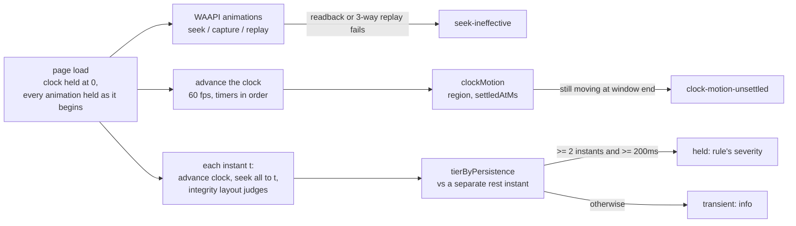

# Motion with the page clock held: three ideas from HyperFrames

[HyperFrames](https://github.com/heygen-com/hyperframes) renders HTML compositions to deterministic
video for agents. Its rendering core and its `check` command solve a problem vlmkit had only
reported: motion the gates could not hold still. This round took three of its ideas, measured each
on the repo's own animated pages, and changed each where the measurement disagreed.

**Result:**
- `check animation` can now measure script-driven motion (`--virtual-time`).
- It says when its own frames are not measurements (`seek-ineffective`).
- `check integrity --timeline` judges layout while the page moves, and tiers each finding by how
  long it holds.

On the 21 animated pages in the repo the new paths change no verdict. Every defect the fixtures
plant is found. Getting there took five changes the first versions did not have.

## What HyperFrames does, and what was taken

| HyperFrames (file) | What it does | Taken as |
|---|---|---|
| `producer/src/services/fileServer.ts` | Freezes `Date` / `performance.now`, queues `requestAnimationFrame`, flushes it once per seek | `VIRTUAL_CLOCK_SCRIPT` (`@mizchi/vlmkit-animation-eval/virtual-clock.ts`), with timers virtual too and 60 fps steps |
| `core/src/runtime/adapters/seek-dispatch.ts` | `hf-seek` event with `waitUntil` for canvas / WebGL | `vlmkit:seek` (`detail.timeMs`, `detail.waitUntil`) |
| `cli/src/utils/checkPipeline.ts` `sweep_static` | Error when seeking changed nothing, because every other green is then meaningless | `seek-ineffective` (suspect), per animation |
| `cli/src/utils/layoutAudit.ts` `applyPersistenceTier` | One sample is info; held over samples is a real finding | `tierByPersistence` (`@mizchi/vlmkit-judge/persistence.ts`) + `check integrity --timeline` |

Not taken:
- BeginFrame capture: Linux only, and HyperFrames itself needs a liveness probe and a fallback.
- The encoder matrix, Lambda rendering and audio: these make video, and vlmkit judges pages.
- PSNR golden videos as the oracle: vlmkit's gates report measured findings, not similarity.

## Measurements

**`seek-ineffective`.** It was found by reproducing a false green first. A page re-creates its
animated element every 100 ms, as a framework re-render does. Before this change it came back
`visible` with "No animation issues detected". The pixels came from the page's own re-render.
Read-back now catches it: the held `Animation` is no longer on the page. A rAF ticker repainting
the same element is caught by replay. Across 18 animated pages and 59 evaluated animations, the
rule raised no false positive.

**The replay needed a third frame.** One mismatch flagged a pure-CSS `alternate infinite` badge
(`promo/attempt-haiku-r2.html`) in 2 runs of 30, with and without the clock. A capture can land
before the compositor applies a seek. A race leaves two of three frames equal, while motion the seek
does not control makes all three differ. After the change: 0 of 50, and the ticker is still caught
every run.

**`vlmkit-anim`'s runtime is exactly this case.** Its master clock is a rAF loop that rewrites every
animation's `currentTime` each frame. On the wall clock, every seek is overwritten, and the rule now
flags every animation on an autoplaying page, correctly. With the clock held, the same page is clean,
its motion settles at 1500 ms, and reduced motion is honoured. `vlmkit-anim eval` therefore holds
the clock by default (`--real-clock` opts out). `runtime.test.ts` pins both readings.

**`--virtual-time`** on six script-driven pages:

| Page | Wall clock | Clock held |
|---|---|---|
| rAF entrance (600 ms) | `uncontrolled-motion` | settles by 750 ms (the sample at or after 600) |
| rAF spinner | `uncontrolled-motion` | `clock-motion-unsettled` |
| `setInterval` colour carousel (500 ms) | **nothing**: both rest captures fell between ticks | `clock-motion-unsettled` |
| rAF spinner that ignores reduced motion | `uncontrolled-motion` | `reduced-motion-ignored`, naming `matchMedia` |
| the same spinner reading `matchMedia` | `uncontrolled-motion` | reduced-motion honoured |
| canvas drawn on `vlmkit:seek` | nothing | settles at 1500 ms, the instant its draw stops moving |

On the 21 CSS-animated pages, findings with and without the flag are identical apart from the
script motion it now measures.

**`--timeline`**, on the paired fixtures (`fixtures/integrity-timeline/`):

| Fixture | Planted | Reported |
|---|---|---|
| `held` | card over the label 200–800 ms | held 250–500 ms, `occluded-text` at its severity |
| `transient` | card crosses the label 450–550 ms | transient at 500 ms, verdict clean |
| `clean` | card moves below the label | nothing |
| `at-rest` | card ends on the label | the settled run's finding, not repeated |
| `script` | the `held` motion from a rAF loop | held, "the settled run measured it mid-motion" |
| `fade-in` | heading and paragraph fade in | nothing |
| `background-late` | white text whose dark background arrives at 480–800 ms | held 0–500 ms, `invisible-text` |

On the 21 animated pages (1280 and 375 px) there are no verdict changes and no held findings.
There are 8 transient glimpses, 7 of them solitaire cards crossing during the deal.

## What the first versions got wrong

1. **Entrance fades were reported as contrast failures.** Six of the eight dogfood-animation pages
   flipped from clean to `defects` on fades alone. Mid-motion contrast is now judged only on text at
   full opacity, counting both the opacity product and the alpha of the text colour. A fade at 40%
   is the animation itself. `background-late.html` shows that a real case is still found.
2. **Two samples were taken as a state.** Instants picked from animation boundaries bunch up: 120 ms
   and 125 ms, or 250 ms and 260 ms. A solitaire card crossing its neighbour for 10 ms read as held.
   A held finding now needs both conditions: two consecutive instants, and at least 200 ms between
   them.
3. **The last instant was taken as rest.** `--timeline-at 0,250,500` ends mid-motion, so the planted
   defect read as "at rest" and was dropped. Rest is now a separate instant past the end of every
   finite animation and 2 s.
4. **The wall-clock sweep was taken as rest.** On a rAF page, the ordinary settled run measured the
   card mid-motion and called that a resting defect. The timeline's own rest instant now decides,
   and a finding the sweep caught mid-motion is re-tiered.
5. **Loading with the clock held hung on page timers.** `settlePage`'s animation wait races a page
   `setTimeout` that never fires. Both paths now call `settlePage(page, 0, 0)`.

## Known limits

- **CSS animations a script starts later are held when the browser next renders.** Their `startAt`
  on the page timeline can be late by up to the advance that started them.
- **The contrast collector resolves background from ancestors only.** White text over a dark
  *sibling* reads as invisible at rest. This predates the round, and the timeline inherits it.
- **Some motion no page clock reaches.** Video, animated images and workers. With
  `--virtual-time`, `uncontrolled-motion` now says this is what remains.
- **Sample instants set the resolution.** A defect held between two instants that are more than
  200 ms apart is seen as one glimpse if only one instant falls inside it.

Rules: 208 → 210 (`seek-ineffective`, `clock-motion-unsettled`). `--timeline` adds none: it uses
integrity's own rule ids and severities.
