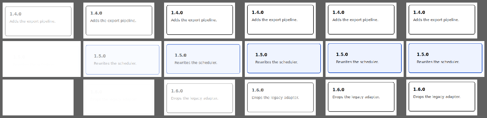

They come in **one after another**, not all at once — 60 ms apart.



Each row is one card (top to bottom: 1.4.0, 1.5.0, 1.6.0). Columns are shared
instants on one page clock: **62 / 123 / 185 / 247 / 308 / 370 ms** after load.
Read it diagonally — at 62 ms the first card is already half-faded-in, the second
is a faint ghost, the third is still blank; by 123 ms the first is nearly solid and
the third is only starting. That staircase is the stagger.

Mechanically: `rise` is 250 ms ease-out (fade + 10px translateY) with
`animation-delay` 0 / 60 / 120 ms, so the last card lands at 370 ms.

The spinner is excluded on purpose (it is unchanged and runs forever, so it would
just add noise to every column).

Generated with:

```
vlmkit check animation page/index.html --samples 6 --strip-window 370 \
  --strip-selector '.card' --strip cards-370.webp
```

Unrelated to this change, but the same run flags two pre-existing things worth a
follow-up issue: `h1`'s `bump` animation animates only `z-index` and produces no
visible pixel change, and none of the five animations are suppressed under
`prefers-reduced-motion: reduce`.
